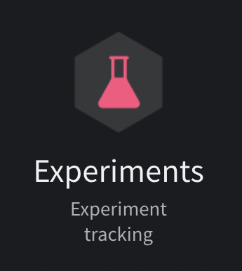
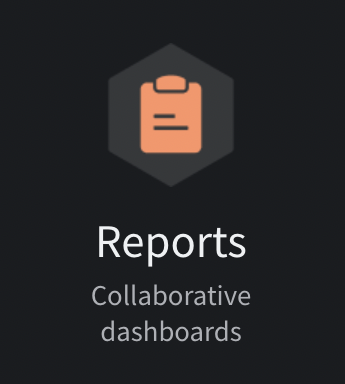
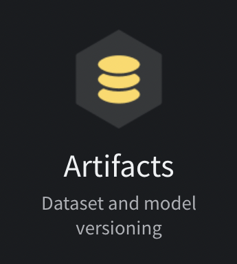
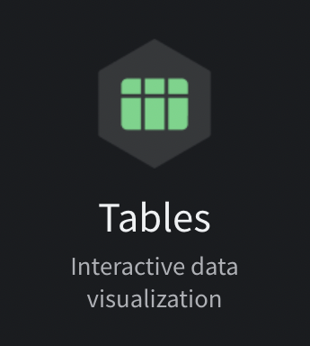
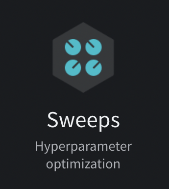
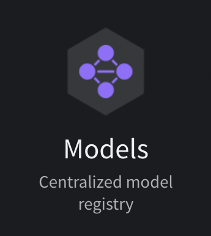
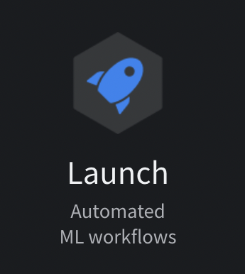

<p align="center">
  
  
</p>

<p align='center'>
<a href="https://pypi.python.org/pypi/wandb"></a>
<a href="https://anaconda.org/conda-forge/wandb"></a>
<a href="hhttps://circleci.com/gh/wandb/wandb"></a>
<a href="https://codecov.io/gh/wandb/wandb"></a>
</p>
<p align='center'>
<a href="https://colab.research.google.com/github/wandb/examples/blob/master/colabs/intro/Intro_to_Weights_%26_Biases.ipynb"></a>
</p>

Use W&B to build better models faster. Track and visualize all the pieces of your machine learning pipeline, from datasets to production machine learning models. Get started with W&B today, [sign up for a free account!](https://wandb.com?utm_source=github&utm_medium=code&utm_campaign=wandb&utm_content=readme)

<p align='center'>
<a href="https://docs.wandb.ai/guides/track?utm_source=github&utm_medium=code&utm_campaign=wandb&utm_content=readme"></a>
<a href="https://docs.wandb.ai/guides/reports?utm_source=github&utm_medium=code&utm_campaign=wandb&utm_content=readme"></a>
<a href="https://docs.wandb.ai/guides/artifacts?utm_source=github&utm_medium=code&utm_campaign=wandb&utm_content=readme"></a>
<a href="https://docs.wandb.ai/guides/data-vis?utm_source=github&utm_medium=code&utm_campaign=wandb&utm_content=readme"></a>
<a href="https://docs.wandb.ai/guides/sweeps?utm_source=github&utm_medium=code&utm_campaign=wandb&utm_content=readme"></a>
<a href="https://docs.wandb.ai/guides/models?utm_source=github&utm_medium=code&utm_campaign=wandb&utm_content=readme"></a>
<a href="https://docs.wandb.ai/guides/launch?utm_source=github&utm_medium=code&utm_campaign=wandb&utm_content=readme"></a>
</p>

&nbsp;

🎓 W&B is free for students, educators, and academic researchers. For more information, visit [https://wandb.ai/site/research](https://wandb.ai/site/research?utm_source=github&utm_medium=code&utm_campaign=wandb&utm_content=readme).

<!-- | Experiments | Reports | Artifacts | Tables | Sweeps | Models | Launch |
| ----------- | ------- | --------- | ------ | ------ | ------ | ------ |
| Text        | Text    | Text      | Text   | Text   | Text   | Text   | -->

&nbsp;

# Documentation

See the [W&B Developer Guide](https://docs.wandb.ai/?utm_source=github&utm_medium=code&utm_campaign=wandb&utm_content=documentation) and [API Reference Guide](https://docs.wandb.ai/ref?utm_source=github&utm_medium=code&utm_campaign=wandb&utm_content=documentation) for a full technical description of the W&B platform.

&nbsp;

# Quickstart

Get started with W&B in four steps:

1. First, sign up for a [free W&B account](https://wandb.ai/login?utm_source=github&utm_medium=code&utm_campaign=wandb&utm_content=quickstart).

2. Second, install the W&B SDK with [pip](https://pip.pypa.io/en/stable/). Navigate to your terminal and type the following command:

```bash
pip install wandb
```

3. Third, log into W&B:

```python
wandb.login()
```

4. Use the example code snippet below as a template to integrate W&B to your Python script:

```python
import wandb

# Start a W&B Run with wandb.init
wandb.init(project="my_first_project")

# Save model inputs and hyperparameters in a wandb.config object
config = wandb.config
config.learning_rate = 0.01

# Model training code here ...

# Log metrics over time to visualize performance with wandb.log
for i in range(10):
    wandb.log({"loss": loss})
```

That's it! Navigate to the W&B App to view a dashboard of your first W&B Experiment. Use the W&B App to compare multiple experiments in a unified place, dive into the results of a single run, and much more!

<p align='center'>

</p>
<p align = "center">
Example W&B Dashboard that shows Wuns from an Experiment.
</p>

&nbsp;

# Integrations

Use your favorite framework with W&B. W&B integrations make it fast and easy to set up experiment tracking and data versioning inside existing projects.

<!-- <p align='center'>

</p> -->

<details>
<summary>🥕 Keras</summary>
Use W&B Callbacks to automatically save metrics to W&B when you call `model.fit` during training.

The following code example demonstrates how your script might look like when you integrate W&B with Keras:

```python
# This script needs these libraries to be installed:
#   tensorflow, numpy

import wandb
from wandb.keras import WandbMetricsLogger, WandbModelCheckpoint

import random
import numpy as np
import tensorflow as tf


# Start a run, tracking hyperparameters
wandb.init(
    # set the wandb project where this run will be logged
    project="my-awesome-project",

    # track hyperparameters and run metadata with wandb.config
    config={
        "layer_1": 512,
        "activation_1": "relu",
        "dropout": random.uniform(0.01, 0.80),
        "layer_2": 10,
        "activation_2": "softmax",
        "optimizer": "sgd",
        "loss": "sparse_categorical_crossentropy",
        "metric": "accuracy",
        "epoch": 8,
        "batch_size": 256
    }
)

# [optional] use wandb.config as your config
config = wandb.config

# get the data
mnist = tf.keras.datasets.mnist
(x_train, y_train), (x_test, y_test) = mnist.load_data()
x_train, x_test = x_train / 255.0, x_test / 255.0
x_train, y_train = x_train[::5], y_train[::5]
x_test, y_test = x_test[::20], y_test[::20]
labels = [str(digit) for digit in range(np.max(y_train) + 1)]

# build a model
model = tf.keras.models.Sequential([
    tf.keras.layers.Flatten(input_shape=(28, 28)),
    tf.keras.layers.Dense(config.layer_1, activation=config.activation_1),
    tf.keras.layers.Dropout(config.dropout),
    tf.keras.layers.Dense(config.layer_2, activation=config.activation_2)
    ])

# compile the model
model.compile(optimizer=config.optimizer,
              loss=config.loss,
              metrics=[config.metric]
              )

# WandbMetricsLogger will log train and validation metrics to wandb
# WandbModelCheckpoint will upload model checkpoints to wandb
history = model.fit(x=x_train, y=y_train,
                    epochs=config.epoch,
                    batch_size=config.batch_size,
                    validation_data=(x_test, y_test),
                    callbacks=[
											WandbMetricsLogger(log_freq=5),
											WandbModelCheckpoint("models")
										])

# [optional] finish the wandb run, necessary in notebooks
wandb.finish()
```

Get started integrating your Keras model with W&B today:

- Run an example [Google Colab Notebook](https://wandb.me/intro-keras?utm_source=github&utm_medium=code&utm_campaign=wandb&utm_content=integrations)
- Read the [Developer Guide](https://docs.wandb.com/library/integrations/keras?utm_source=github&utm_medium=code&utm_campaign=wandb&utm_content=integrations) for technical details on how to integrate Keras with W&B.
- Explore [W&B Reports](https://app.wandb.ai/wandb/getting-started/reports/Keras--VmlldzoyMTEwNjQ?utm_source=github&utm_medium=code&utm_campaign=wandb&utm_content=integrations).

</details>

<details>
<summary>🤗 Hugging Face</summary>

Pass `wandb` to the `report_to` argument when you run a script using a HuggingFace Trainer. W&B will automatically log losses,
evaluation metrics, model topology, and gradients.

**Note**: The environment you run your script in must have `wandb` installed.

The following example demonstrates how to integrate W&B with Hugging Face:

```python
# This script needs these libraries to be installed:
#   numpy, transformers, datasets

import wandb

import os
import numpy as np
from datasets import load_dataset
from transformers import TrainingArguments, Trainer
from transformers import AutoTokenizer, AutoModelForSequenceClassification


def tokenize_function(examples):
    return tokenizer(examples["text"], padding="max_length", truncation=True)

def compute_metrics(eval_pred):
    logits, labels = eval_pred
    predictions = np.argmax(logits, axis=-1)
    return {"accuracy": np.mean(predictions == labels)}


# download prepare the data
dataset = load_dataset("yelp_review_full")
tokenizer = AutoTokenizer.from_pretrained("distilbert-base-uncased")

small_train_dataset = dataset["train"].shuffle(seed=42).select(range(1000))
small_eval_dataset = dataset["test"].shuffle(seed=42).select(range(300))

small_train_dataset = small_train_dataset.map(tokenize_function, batched=True)
small_eval_dataset = small_train_dataset.map(tokenize_function, batched=True)

# download the model
model = AutoModelForSequenceClassification.from_pretrained("distilbert-base-uncased", num_labels=5)

# set the wandb project where this run will be logged
os.environ["WANDB_PROJECT"]="my-awesome-project"

# save your trained model checkpoint to wandb
os.environ["WANDB_LOG_MODEL"]="true"

# turn off watch to log faster
os.environ["WANDB_WATCH"]="false"

# pass "wandb" to the `report_to` parameter to turn on wandb logging
training_args = TrainingArguments(
    output_dir='models',
    report_to="wandb",
    logging_steps=5,
    per_device_train_batch_size=32,
    per_device_eval_batch_size=32,
    evaluation_strategy="steps",
    eval_steps=20,
    max_steps = 100,
    save_steps = 100
)

# define the trainer and start training
trainer = Trainer(
    model=model,
    args=training_args,
    train_dataset=small_train_dataset,
    eval_dataset=small_eval_dataset,
    compute_metrics=compute_metrics,
)
trainer.train()

# [optional] finish the wandb run, necessary in notebooks
wandb.finish()
```

- Run an example [Google Colab Notebook](http://wandb.me/hf?utm_source=github&utm_medium=code&utm_campaign=wandb&utm_content=integrations).
- Read the [Developer Guide](https://docs.wandb.com/library/integrations/huggingface?utm_source=github&utm_medium=code&utm_campaign=wandb&utm_content=integrations) for technical details on how to integrate Hugging Face with W&B.
</details>
<details>
<summary>🔥 PyTorch</summary>

Call `.watch` and pass in your PyTorch model to automatically log gradients and store the network topology. Next, use `.log` to track other metrics. The following example demonstrates an example of how to do this:

```python
import wandb

# 1. Start a new run
wandb.init(project="gpt4")

# 2. Save model inputs and hyperparameters
config = wandb.config
config.dropout = 0.01

# 3. Log gradients and model parameters
wandb.watch(model)
for batch_idx, (data, target) in enumerate(train_loader):
    ...
    if batch_idx % args.log_interval == 0:
        # 4. Log metrics to visualize performance
        wandb.log({"loss": loss})
```

- Run an example [Google Colab Notebook](http://wandb.me/pytorch-colab).
- Read the [Developer Guide](https://docs.wandb.com/library/integrations/pytorch?utm_source=github&utm_medium=code&utm_campaign=wandb&utm_content=integrations) for technical details on how to integrate PyTorch with W&B.
- Explore [W&B Reports](https://app.wandb.ai/wandb/getting-started/reports/Pytorch--VmlldzoyMTEwNzM?utm_source=github&utm_medium=code&utm_campaign=wandb&utm_content=integrations).

</details>

<details>
<summary>🌊 TensorFlow</summary>

The simplest way to log metrics in TensorFlow is by logging `tf.summary` with the W&B TensorFlow logger:

```python
import wandb

# 1. Start a W&B run
wandb.init(project="gpt4")

# 2. Save model inputs and hyperparameters
config = wandb.config
config.learning_rate = 0.01

# Model training here

# 3. Log metrics over time to visualize performance
with tf.Session() as sess:
    # ...
    wandb.tensorflow.log(tf.summary.merge_all())
```

- Run an example [Google Colab Notebook](http://wandb.me/tf-colab?utm_source=github&utm_medium=code&utm_campaign=wandb&utm_content=integrations).
- Read the [Developer Guide](https://docs.wandb.com/library/integrations/tensorflow?utm_source=github&utm_medium=code&utm_campaign=wandb&utm_content=integrations) for technical details on how to integrate TensorFlow with W&B.

</details>

<details>
<summary>⚡️ PyTorch Lightning</summary>

Build scalable, structured, high-performance PyTorch models with Lightning and log them with W&B.

```python
# This script needs these libraries to be installed:
#   torch, torchvision, pytorch_lightning

import wandb

import os
from torch import optim, nn, utils, Tensor
from torchvision.datasets import MNIST
from torchvision.transforms import ToTensor

import pytorch_lightning as pl
from pytorch_lightning.loggers import WandbLogger


class LitAutoEncoder(pl.LightningModule):
    def __init__(self, lr=1e-3, inp_size=28, optimizer = 'Adam'):
        super().__init__()

        self.encoder = nn.Sequential(nn.Linear(inp_size * inp_size, 64), nn.ReLU(), nn.Linear(64, 3))
        self.decoder = nn.Sequential(nn.Linear(3, 64), nn.ReLU(), nn.Linear(64, inp_size * inp_size))
        self.lr = lr

        # save hyper-parameters to self.hparamsm auto-logged by wandb
        self.save_hyperparameters()

    def training_step(self, batch, batch_idx):
        x, y = batch
        x = x.view(x.size(0), -1)
        z = self.encoder(x)
        x_hat = self.decoder(z)
        loss = nn.functional.mse_loss(x_hat, x)

        # log metrics to wandb
        self.log("train_loss", loss)
        return loss

    def configure_optimizers(self):
        optimizer = optim.Adam(self.parameters(), lr=self.lr)
        return optimizer


# init the autoencoder
autoencoder = LitAutoEncoder(lr=1e-3, inp_size=28)

# setup data
batch_size = 32
dataset = MNIST(os.getcwd(), download=True, transform=ToTensor())
train_loader = utils.data.DataLoader(dataset, shuffle=True)

# initialise the wandb logger and name your wandb project
wandb_logger = WandbLogger(project='my-awesome-project')

# add your batch size to the wandb config
wandb_logger.experiment.config["batch_size"] = batch_size

# pass wandb_logger to the Trainer
trainer = pl.Trainer(limit_train_batches=750, max_epochs=5, logger=wandb_logger)

# train the model
trainer.fit(model=autoencoder, train_dataloaders=train_loader)

# [optional] finish the wandb run, necessary in notebooks
wandb.finish()
```

- Run an example [Google Colab Notebook](http://wandb.me/lightning?utm_source=github&utm_medium=code&utm_campaign=wandb&utm_content=integrations).
- Read the [Developer Guide](https://docs.wandb.ai/guides/integrations/lightning?utm_source=github&utm_medium=code&utm_campaign=wandb&utm_content=integrations) for technical details on how to integrate PyTorch Lightning with W&B.

</details>

&nbsp;

# Tutorials

Explore example Colab Notebooks at [wandb/examples GitHub repository](https://github.com/wandb/examples/tree/master/colabs). Here are some of our favorites:

[INSERT]

&nbsp;

# Contribution guidelines

Weights & Biases ❤️ open source and we welcome contributions from the community! See the [Contribution guide](https://github.com/wandb/wandb/blob/main/CONTRIBUTING.md) for more information on the development workflow and the internals of the wandb library.

&nbsp;

# Contact

If you have any questions, please don't hesitate to ask in our [user forum](http://wandb.me/forum?utm_source=github&utm_medium=code&utm_campaign=wandb&utm_content=contact). For wandb bugs and feature requests please visit [GitHub Issues](https://github.com/wandb/wandb/issues?utm_source=github&utm_medium=code&utm_campaign=wandb&utm_content=contact). For professional support please Contact Us. Be a part of the W&B Community, post your questions at [W&B Community](https://community.wandb.ai/?utm_source=github&utm_medium=code&utm_campaign=wandb&utm_content=contact). Stay connected with the latest updates with [W&B Fully Connected](https://wandb.ai/fully-connected?utm_source=github&utm_medium=code&utm_campaign=wandb&utm_content=contact).

&nbsp;

# License

[MIT License](https://github.com/wandb/wandb/blob/main/LICENSE)
