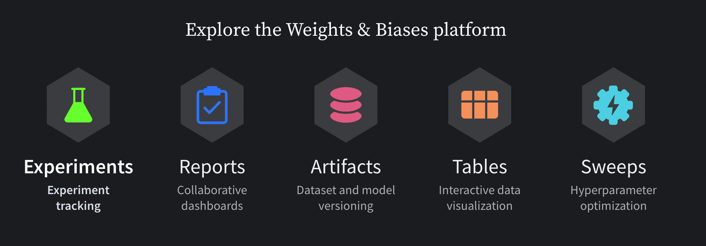

<p align="center">
  
  
</p>

# Weights and Biases [](https://pypi.python.org/pypi/wandb) [](https://anaconda.org/conda-forge/wandb) [](https://circleci.com/gh/wandb/wandb) [](https://codecov.io/gh/wandb/wandb)

Use W&B to build better models faster. Track and visualize all the pieces of your machine learning pipeline, from datasets to production models. 

[Add more info, less markety sentence or two here?]

<p align='center'>

</p>

[It would be cool to have make the above icons click-able. Thoughts?]

[Sign up for a free account →](https://wandb.com)  

&nbsp;

# Documentation
See the [W&B Developer Guide](https://docs.wandb.ai/) and [API Reference Guide](https://docs.wandb.ai/ref) for a full technical description of the W&B platform. 

&nbsp;

# Install
Install the W&B SDK with [pip](https://pip.pypa.io/en/stable/):
``` bash
pip install wandb
```
&nbsp;

# Quickstart
Sign up for a free W&B account and log into W&B:

``` python
wandb.login()
```

Next, use the example code snippet to integrate W&B to your Python script:

``` python
import wandb

# 1. Start a W&B run
wandb.init(project="gpt3")

# 2. Save model inputs and hyperparameters
config = wandb.config
config.learning_rate = 0.01

# Model training code here ...

# 3. Log metrics over time to visualize performance
for i in range(10):
    wandb.log({"loss": loss})
```


### [Try in a colab →](http://wandb.me/intro)

&nbsp;

# Tutorials
[Noah to link to tutorials and/or reports?]

&nbsp;

# Integrations
Use your favorite framework with W&B. W&B integrations make it fast and easy to set up experiment tracking and data versioning inside existing projects.

[Add image]

<details>
<summary>🥕 Keras</summary>

In Keras, you can use our callback to automatically save all the metrics tracked in `model.fit`. To get you started here's a minimal example:
```python
# Import W&B
import wandb
from wandb.keras import WandbCallback

# Step1: Initialize W&B run
wandb.init(project="project_name")

# 2. Save model inputs and hyperparameters
config = wandb.config
config.learning_rate = 0.01

# Model training code here ...

# Step 3: Add WandbCallback
model.fit(
    X_train, y_train, validation_data=(X_test, y_test), callbacks=[WandbCallback()]
)
```

- **[Try in a colab →](http://wandb.me/keras-colab)**
- [Learn More](https://app.wandb.ai/wandb/getting-started/reports/Keras--VmlldzoyMTEwNjQ)
- [Docs](https://docs.wandb.com/library/integrations/keras)

</details>

<details>
<summary>🔥 PyTorch</summary>

W&B provides first class support for PyTorch. To automatically log gradients and store the network topology, you can call `.watch` and pass in your PyTorch model.
Then use `.log` for anything else you want to track, like so:
```python
import wandb

# 1. Start a new run
wandb.init(project="gpt-3")

# 2. Save model inputs and hyperparameters
config = wandb.config
config.dropout = 0.01

# 3. Log gradients and model parameters
wandb.watch(model)
for batch_idx, (data, target) in enumerate(train_loader):
    ...
    if batch_idx % args.log_interval == 0:
        # 4. Log metrics to visualize performance
        wandb.log({"loss": loss})
```

- **[Try in a colab →](http://wandb.me/pytorch-colab)**
- [Learn More](https://app.wandb.ai/wandb/getting-started/reports/Pytorch--VmlldzoyMTEwNzM)
- [Docs](https://docs.wandb.com/library/integrations/pytorch)

</details>

<details>
<summary>🌊 TensorFlow</summary>

The simplest way to log metrics in TensorFlow is by logging `tf.summary` with our TensorFlow logger:
```python
import wandb

# 1. Start a W&B run
wandb.init(project="gpt3")

# 2. Save model inputs and hyperparameters
config = wandb.config
config.learning_rate = 0.01

# Model training here

# 3. Log metrics over time to visualize performance
with tf.Session() as sess:
    # ...
    wandb.tensorflow.log(tf.summary.merge_all())
```

- **[Try in a colab →](http://wandb.me/tf-colab)**
- [Docs](https://docs.wandb.com/library/integrations/tensorflow)

</details>

<details>
<summary>⚡️ PyTorch Lightning</summary>

Build scalable, structured, high-performance PyTorch models with Lightning and log them with W&B.
```python
from pytorch_lightning.loggers import WandbLogger
from pytorch_lightning import Trainer

wandb_logger = WandbLogger(project="gpt-3")
trainer = Trainer(logger=wandb_logger)
```

- **[Try in a colab →](http://wandb.me/lightning)**
- [Docs](https://docs.wandb.ai/guides/integrations/lightning)

</details>

&nbsp;

# Contribution guidelines
We at Weights & Biases ❤️ open source and welcome contributions from the community! See the [Contribution guide](https://github.com/wandb/wandb/blob/main/CONTRIBUTING.md) for more information on the development workflow and the internals of the wandb library.

&nbsp;


# Contact
If you have any questions, please don't hesitate to ask in our [user forum](http://wandb.me/forum). For wandb bugs and feature requests please visit [GitHub Issues](https://github.com/wandb/wandb/issues). For professional support please Contact Us. Be a part of the W&B Community, post your qeustions at [W&B Community](https://community.wandb.ai/). Stay connected with the latest updates with [W&B Fully Connected](https://wandb.ai/fully-connected).

&nbsp;

# License

[MIT License](https://github.com/wandb/wandb/blob/main/LICENSE)
