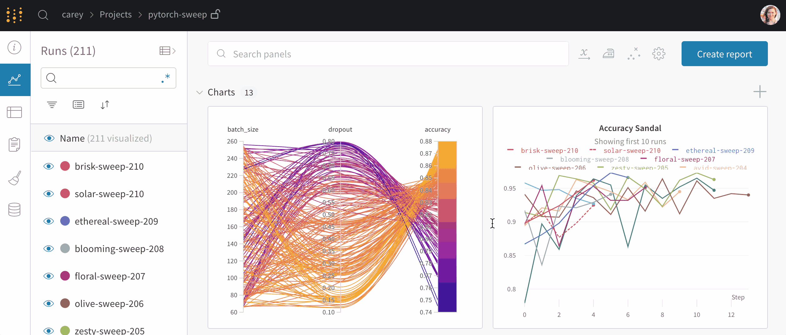
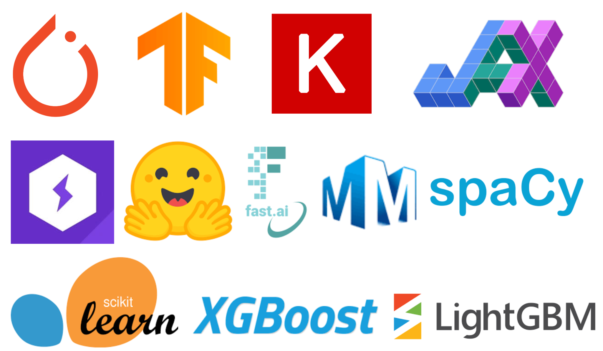

<p align="center">
  
  
</p>

<p align='center'>
<a href="https://pypi.python.org/pypi/wandb"></a>
<a href="https://anaconda.org/conda-forge/wandb"></a>
<a href="https://circleci.com/gh/wandb/wandb"></a>
<a href="https://codecov.io/gh/wandb/wandb"></a>
</p>
<p align='center'>
<a href="https://colab.research.google.com/github/wandb/examples/blob/master/colabs/intro/Intro_to_Weights_%26_Biases.ipynb"></a>
</p>

Use W&B to build better models faster. Track and visualize all the pieces of your machine learning pipeline, from datasets to production machine learning models. Get started with W&B today, [sign up for a free account!](https://wandb.com?utm_source=github&utm_medium=code&utm_campaign=wandb&utm_content=readme)

🎓 W&B is free for students, educators, and academic researchers. For more information, visit [https://wandb.ai/site/research](https://wandb.ai/site/research?utm_source=github&utm_medium=code&utm_campaign=wandb&utm_content=readme).

Want to use Weights & Biases for seamless collaboration between your ML or Data Science team? Looking for Production-grade MLOps at scale? Sign up to one of [our plans](https://wandb.ai/site/pricing) or [contact the Sales Team](https://wandb.ai/site/contact).

&nbsp;

# Documentation

<p align='center'>
<a target="_blank" href="https://docs.wandb.ai/guides/track?utm_source=github&utm_medium=code&utm_campaign=wandb&utm_content=readme">
<picture>
  <source media="(prefers-color-scheme: dark)" srcset="./docs/README_images/Product_Icons_dark_background/experiments-dark.svg" width="14.0%">
  <source media="(prefers-color-scheme: light)" srcset="./docs/README_images/Product_Icons_light/experiments-light.svg" width="14.0%">
  
</picture>
</a>
<a target="_blank" href="https://docs.wandb.ai/guides/reports?utm_source=github&utm_medium=code&utm_campaign=wandb&utm_content=readme">
<picture>
  <source media="(prefers-color-scheme: dark)" srcset="./docs/README_images/Product_Icons_dark_background/report-dark.svg" width="14.0%">
  <source media="(prefers-color-scheme: light)" srcset="./docs/README_images/Product_Icons_light/report-light.svg" width="14.0%">
  
</picture>
</a>
<a target="_blank" href="https://docs.wandb.ai/guides/artifacts?utm_source=github&utm_medium=code&utm_campaign=wandb&utm_content=readme">
<picture>
  <source media="(prefers-color-scheme: dark)" srcset="./docs/README_images/Product_Icons_dark_background/artifacts-dark.svg" width="14.0%">
  <source media="(prefers-color-scheme: light)" srcset="./docs/README_images/Product_Icons_light/artifacts-light.svg" width="14.0%">
  
</picture>
</a>
<a target="_blank" href="https://docs.wandb.ai/guides/data-vis?utm_source=github&utm_medium=code&utm_campaign=wandb&utm_content=readme">
<picture>
  <source media="(prefers-color-scheme: dark)" srcset="./docs/README_images/Product_Icons_dark_background/tables-dark.svg" width="14.0%">
  <source media="(prefers-color-scheme: light)" srcset="./docs/README_images/Product_Icons_light/tables-light.svg" width="14.0%">
  
</picture>
</a>
<a target="_blank" href="https://docs.wandb.ai/guides/sweeps?utm_source=github&utm_medium=code&utm_campaign=wandb&utm_content=readme">
<picture>
  <source media="(prefers-color-scheme: dark)" srcset="./docs/README_images/Product_Icons_dark_background/sweeps-dark.svg" width="14.0%">
  <source media="(prefers-color-scheme: light)" srcset="./docs/README_images/Product_Icons_light/sweeps-light.svg" width="14.0%">
  
</picture>
</a>
<a target="_blank" href="https://docs.wandb.ai/guides/launch?utm_source=github&utm_medium=code&utm_campaign=wandb&utm_content=readme">
<picture>
  <source media="(prefers-color-scheme: dark)" srcset="./docs/README_images/Product_Icons_dark_background/launch-dark.svg" width="14.0%">
  <source media="(prefers-color-scheme: light)" srcset="./docs/README_images/Product_Icons_light/launch-light.svg" width="14.0%">
  
</picture>
</a>
<a target="_blank" href="https://docs.wandb.ai/guides/models?utm_source=github&utm_medium=code&utm_campaign=wandb&utm_content=readme">
<picture>
  <source media="(prefers-color-scheme: dark)" srcset="./docs/README_images/Product_Icons_dark_background/models-dark.svg" width="14.0%">
  <source media="(prefers-color-scheme: light)" srcset="./docs/README_images/Product_Icons_light/models-light.svg" width="14.0%">
  
</picture>
</a>
</a>
<a target="_blank" href="https://docs.wandb.ai/guides/prompts?utm_source=github&utm_medium=code&utm_campaign=wandb&utm_content=readme">
<picture>
  <source media="(prefers-color-scheme: dark)" srcset="./docs/README_images/Product_Icons_dark_background/prompts-dark.svg" width="14.0%">
  <source media="(prefers-color-scheme: light)" srcset="./docs/README_images/Product_Icons_light/prompts-light.svg" width="14.0%">
  
</picture>
<a target="_blank" href="https://github.com/wandb/weave">
<picture>
  <source media="(prefers-color-scheme: dark)" srcset="./docs/README_images/Product_Icons_dark_background/weave-dark.svg" width="14.0%">
  <source media="(prefers-color-scheme: light)" srcset="./docs/README_images/Product_Icons_light/weave-light.svg" width="14.0%">
  
</picture>
</p>

See the [W&B Developer Guide](https://docs.wandb.ai/?utm_source=github&utm_medium=code&utm_campaign=wandb&utm_content=documentation) and [API Reference Guide](https://docs.wandb.ai/ref?utm_source=github&utm_medium=code&utm_campaign=wandb&utm_content=documentation) for a full technical description of the W&B platform.

# Quickstart

Get started with W&B in four steps:

1. First, sign up for a [free W&B account](https://wandb.ai/login?utm_source=github&utm_medium=code&utm_campaign=wandb&utm_content=quickstart).

2. Second, install the W&B SDK with [pip](https://pip.pypa.io/en/stable/). Navigate to your terminal and type the following command:

```bash
pip install wandb
```

3. Third, log into W&B:

```python
wandb.login()
```

4. Use the example code snippet below as a template to integrate W&B to your Python script:

```python
import wandb

# Start a W&B Run with wandb.init
run = wandb.init(project="my_first_project")

# Save model inputs and hyperparameters in a wandb.config object
config = run.config
config.learning_rate = 0.01

# Model training code here ...

# Log metrics over time to visualize performance with wandb.log
for i in range(10):
    run.log({"loss": loss})
```

That's it! Navigate to the W&B App to view a dashboard of your first W&B Experiment. Use the W&B App to compare multiple experiments in a unified place, dive into the results of a single run, and much more!

<p align='center'>

</p>
<p align = "center">
Example W&B Dashboard that shows Runs from an Experiment.
</p>

&nbsp;

# Integrations

Use your favorite framework with W&B. W&B integrations make it fast and easy to set up experiment tracking and data versioning inside existing projects. For more information on how to integrate W&B with the framework of your choice, see the [Integrations chapter](https://docs.wandb.ai/guides/integrations) in the W&B Developer Guide.

<!-- <p align='center'>

</p> -->

<details>
<summary>🔥 PyTorch</summary>

Call `.watch` and pass in your PyTorch model to automatically log gradients and store the network topology. Next, use `.log` to track other metrics. The following example demonstrates an example of how to do this:

```python
import wandb

# 1. Start a new run
run = wandb.init(project="gpt4")

# 2. Save model inputs and hyperparameters
config = run.config
config.dropout = 0.01

# 3. Log gradients and model parameters
run.watch(model)
for batch_idx, (data, target) in enumerate(train_loader):
    ...
    if batch_idx % args.log_interval == 0:
        # 4. Log metrics to visualize performance
        run.log({"loss": loss})
```

- Run an example [Google Colab Notebook](http://wandb.me/pytorch-colab).
- Read the [Developer Guide](https://docs.wandb.com/guides/integrations/pytorch?utm_source=github&utm_medium=code&utm_campaign=wandb&utm_content=integrations) for technical details on how to integrate PyTorch with W&B.
- Explore [W&B Reports](https://app.wandb.ai/wandb/getting-started/reports/Pytorch--VmlldzoyMTEwNzM?utm_source=github&utm_medium=code&utm_campaign=wandb&utm_content=integrations).

</details>
<details>
<summary>🌊 TensorFlow/Keras</summary>
Use W&B Callbacks to automatically save metrics to W&B when you call `model.fit` during training.

The following code example demonstrates how your script might look like when you integrate W&B with Keras:

```python
# This script needs these libraries to be installed:
#   tensorflow, numpy

import wandb
from wandb.keras import WandbMetricsLogger, WandbModelCheckpoint

import random
import numpy as np
import tensorflow as tf


# Start a run, tracking hyperparameters
run = wandb.init(
    # set the wandb project where this run will be logged
    project="my-awesome-project",
    # track hyperparameters and run metadata with wandb.config
    config={
        "layer_1": 512,
        "activation_1": "relu",
        "dropout": random.uniform(0.01, 0.80),
        "layer_2": 10,
        "activation_2": "softmax",
        "optimizer": "sgd",
        "loss": "sparse_categorical_crossentropy",
        "metric": "accuracy",
        "epoch": 8,
        "batch_size": 256,
    },
)

# [optional] use wandb.config as your config
config = run.config

# get the data
mnist = tf.keras.datasets.mnist
(x_train, y_train), (x_test, y_test) = mnist.load_data()
x_train, x_test = x_train / 255.0, x_test / 255.0
x_train, y_train = x_train[::5], y_train[::5]
x_test, y_test = x_test[::20], y_test[::20]
labels = [str(digit) for digit in range(np.max(y_train) + 1)]

# build a model
model = tf.keras.models.Sequential(
    [
        tf.keras.layers.Flatten(input_shape=(28, 28)),
        tf.keras.layers.Dense(config.layer_1, activation=config.activation_1),
        tf.keras.layers.Dropout(config.dropout),
        tf.keras.layers.Dense(config.layer_2, activation=config.activation_2),
    ]
)

# compile the model
model.compile(optimizer=config.optimizer, loss=config.loss, metrics=[config.metric])

# WandbMetricsLogger will log train and validation metrics to wandb
# WandbModelCheckpoint will upload model checkpoints to wandb
history = model.fit(
    x=x_train,
    y=y_train,
    epochs=config.epoch,
    batch_size=config.batch_size,
    validation_data=(x_test, y_test),
    callbacks=[
        WandbMetricsLogger(log_freq=5),
        WandbModelCheckpoint("models"),
    ],
)

# [optional] finish the wandb run, necessary in notebooks
run.finish()
```

Get started integrating your Keras model with W&B today:

- Run an example [Google Colab Notebook](https://wandb.me/intro-keras?utm_source=github&utm_medium=code&utm_campaign=wandb&utm_content=integrations)
- Read the [Developer Guide](https://docs.wandb.com/guides/integrations/keras?utm_source=github&utm_medium=code&utm_campaign=wandb&utm_content=integrations) for technical details on how to integrate Keras with W&B.
- Explore [W&B Reports](https://app.wandb.ai/wandb/getting-started/reports/Keras--VmlldzoyMTEwNjQ?utm_source=github&utm_medium=code&utm_campaign=wandb&utm_content=integrations).

</details>
<details>
<summary>🤗 Hugging Face Transformers</summary>

Pass `wandb` to the `report_to` argument when you run a script using a Hugging Face Trainer. W&B will automatically log losses,
evaluation metrics, model topology, and gradients.

**Note**: The environment you run your script in must have `wandb` installed.

The following example demonstrates how to integrate W&B with Hugging Face:

```python
# This script needs these libraries to be installed:
#   numpy, transformers, datasets

import wandb

import os
import numpy as np
from datasets import load_dataset
from transformers import TrainingArguments, Trainer
from transformers import AutoTokenizer, AutoModelForSequenceClassification


def tokenize_function(examples):
    return tokenizer(examples["text"], padding="max_length", truncation=True)


def compute_metrics(eval_pred):
    logits, labels = eval_pred
    predictions = np.argmax(logits, axis=-1)
    return {"accuracy": np.mean(predictions == labels)}


# download prepare the data
dataset = load_dataset("yelp_review_full")
tokenizer = AutoTokenizer.from_pretrained("distilbert-base-uncased")

small_train_dataset = dataset["train"].shuffle(seed=42).select(range(1000))
small_eval_dataset = dataset["test"].shuffle(seed=42).select(range(300))

small_train_dataset = small_train_dataset.map(tokenize_function, batched=True)
small_eval_dataset = small_train_dataset.map(tokenize_function, batched=True)

# download the model
model = AutoModelForSequenceClassification.from_pretrained(
    "distilbert-base-uncased", num_labels=5
)

# set the wandb project where this run will be logged
os.environ["WANDB_PROJECT"] = "my-awesome-project"

# save your trained model checkpoint to wandb
os.environ["WANDB_LOG_MODEL"] = "true"

# turn off watch to log faster
os.environ["WANDB_WATCH"] = "false"

# pass "wandb" to the `report_to` parameter to turn on wandb logging
training_args = TrainingArguments(
    output_dir="models",
    report_to="wandb",
    logging_steps=5,
    per_device_train_batch_size=32,
    per_device_eval_batch_size=32,
    evaluation_strategy="steps",
    eval_steps=20,
    max_steps=100,
    save_steps=100,
)

# define the trainer and start training
trainer = Trainer(
    model=model,
    args=training_args,
    train_dataset=small_train_dataset,
    eval_dataset=small_eval_dataset,
    compute_metrics=compute_metrics,
)
trainer.train()

# [optional] finish the wandb run, necessary in notebooks
wandb.finish()
```

- Run an example [Google Colab Notebook](http://wandb.me/hf?utm_source=github&utm_medium=code&utm_campaign=wandb&utm_content=integrations).
- Read the [Developer Guide](https://docs.wandb.com/guides/integrations/huggingface?utm_source=github&utm_medium=code&utm_campaign=wandb&utm_content=integrations) for technical details on how to integrate Hugging Face with W&B.
</details>

<details>
<summary>⚡️ PyTorch Lightning</summary>

Build scalable, structured, high-performance PyTorch models with Lightning and log them with W&B.

```python
# This script needs these libraries to be installed:
#   torch, torchvision, pytorch_lightning

import wandb

import os
from torch import optim, nn, utils
from torchvision.datasets import MNIST
from torchvision.transforms import ToTensor

import pytorch_lightning as pl
from pytorch_lightning.loggers import WandbLogger


class LitAutoEncoder(pl.LightningModule):
    def __init__(self, lr=1e-3, inp_size=28, optimizer="Adam"):
        super().__init__()

        self.encoder = nn.Sequential(
            nn.Linear(inp_size * inp_size, 64), nn.ReLU(), nn.Linear(64, 3)
        )
        self.decoder = nn.Sequential(
            nn.Linear(3, 64), nn.ReLU(), nn.Linear(64, inp_size * inp_size)
        )
        self.lr = lr

        # save hyperparameters to self.hparamsm auto-logged by wandb
        self.save_hyperparameters()

    def training_step(self, batch, batch_idx):
        x, y = batch
        x = x.view(x.size(0), -1)
        z = self.encoder(x)
        x_hat = self.decoder(z)
        loss = nn.functional.mse_loss(x_hat, x)

        # log metrics to wandb
        self.log("train_loss", loss)
        return loss

    def configure_optimizers(self):
        optimizer = optim.Adam(self.parameters(), lr=self.lr)
        return optimizer


# init the autoencoder
autoencoder = LitAutoEncoder(lr=1e-3, inp_size=28)

# setup data
batch_size = 32
dataset = MNIST(os.getcwd(), download=True, transform=ToTensor())
train_loader = utils.data.DataLoader(dataset, shuffle=True)

# initialise the wandb logger and name your wandb project
wandb_logger = WandbLogger(project="my-awesome-project")

# add your batch size to the wandb config
wandb_logger.experiment.config["batch_size"] = batch_size

# pass wandb_logger to the Trainer
trainer = pl.Trainer(limit_train_batches=750, max_epochs=5, logger=wandb_logger)

# train the model
trainer.fit(model=autoencoder, train_dataloaders=train_loader)

# [optional] finish the wandb run, necessary in notebooks
wandb.finish()
```

- Run an example [Google Colab Notebook](http://wandb.me/lightning?utm_source=github&utm_medium=code&utm_campaign=wandb&utm_content=integrations).
- Read the [Developer Guide](https://docs.wandb.ai/guides/integrations/lightning?utm_source=github&utm_medium=code&utm_campaign=wandb&utm_content=integrations) for technical details on how to integrate PyTorch Lightning with W&B.
</details>
<details>
<summary>💨 XGBoost</summary>
Use W&B Callbacks to automatically save metrics to W&B when you call `model.fit` during training.

The following code example demonstrates how your script might look like when you integrate W&B with XGBoost:

```python
# This script needs these libraries to be installed:
#   numpy, xgboost

import wandb
from wandb.xgboost import WandbCallback

import numpy as np
import xgboost as xgb


# setup parameters for xgboost
param = {
    "objective": "multi:softmax",
    "eta": 0.1,
    "max_depth": 6,
    "nthread": 4,
    "num_class": 6,
}

# start a new wandb run to track this script
run = wandb.init(
    # set the wandb project where this run will be logged
    project="my-awesome-project",
    # track hyperparameters and run metadata
    config=param,
)

# download data from wandb Artifacts and prep data
run.use_artifact("wandb/intro/dermatology_data:v0", type="dataset").download(".")
data = np.loadtxt(
    "./dermatology.data",
    delimiter=",",
    converters={33: lambda x: int(x == "?"), 34: lambda x: int(x) - 1},
)
sz = data.shape

train = data[: int(sz[0] * 0.7), :]
test = data[int(sz[0] * 0.7) :, :]

train_X = train[:, :33]
train_Y = train[:, 34]

test_X = test[:, :33]
test_Y = test[:, 34]

xg_train = xgb.DMatrix(train_X, label=train_Y)
xg_test = xgb.DMatrix(test_X, label=test_Y)
watchlist = [(xg_train, "train"), (xg_test, "test")]

# add another config to the wandb run
num_round = 5
run.config["num_round"] = 5
run.config["data_shape"] = sz

# pass WandbCallback to the booster to log its configs and metrics
bst = xgb.train(
    param, xg_train, num_round, evals=watchlist, callbacks=[WandbCallback()]
)

# get prediction
pred = bst.predict(xg_test)
error_rate = np.sum(pred != test_Y) / test_Y.shape[0]

# log your test metric to wandb
run.summary["Error Rate"] = error_rate

# [optional] finish the wandb run, necessary in notebooks
run.finish()
```

- Run an example [Google Colab Notebook](https://wandb.me/xgboost?utm_source=github&utm_medium=code&utm_campaign=wandb&utm_content=integrations).
- Read the [Developer Guide](https://docs.wandb.ai/guides/integrations/xgboost?utm_source=github&utm_medium=code&utm_campaign=wandb&utm_content=integrations) for technical details on how to integrate XGBoost with W&B.
</details>
<details>
<summary>🧮 Sci-Kit Learn</summary>
Use wandb to visualize and compare your scikit-learn models' performance:

```python
# This script needs these libraries to be installed:
#   numpy, sklearn

import wandb
from wandb.sklearn import plot_precision_recall, plot_feature_importances
from wandb.sklearn import plot_class_proportions, plot_learning_curve, plot_roc

import numpy as np
from sklearn import datasets
from sklearn.ensemble import RandomForestClassifier
from sklearn.model_selection import train_test_split


# load and process data
wbcd = datasets.load_breast_cancer()
feature_names = wbcd.feature_names
labels = wbcd.target_names

test_size = 0.2
X_train, X_test, y_train, y_test = train_test_split(
    wbcd.data, wbcd.target, test_size=test_size
)

# train model
model = RandomForestClassifier()
model.fit(X_train, y_train)
model_params = model.get_params()

# get predictions
y_pred = model.predict(X_test)
y_probas = model.predict_proba(X_test)
importances = model.feature_importances_
indices = np.argsort(importances)[::-1]

# start a new wandb run and add your model hyperparameters
run = wandb.init(project="my-awesome-project", config=model_params)

# Add additional configs to wandb
run.config.update(
    {
        "test_size": test_size,
        "train_len": len(X_train),
        "test_len": len(X_test),
    }
)

# log additional visualisations to wandb
plot_class_proportions(y_train, y_test, labels)
plot_learning_curve(model, X_train, y_train)
plot_roc(y_test, y_probas, labels)
plot_precision_recall(y_test, y_probas, labels)
plot_feature_importances(model)

# [optional] finish the wandb run, necessary in notebooks
run.finish()
```

- Run an example [Google Colab Notebook](https://wandb.me/scikit-colab?utm_source=github&utm_medium=code&utm_campaign=wandb&utm_content=integrations).
- Read the [Developer Guide](https://docs.wandb.ai/guides/integrations/scikit?utm_source=github&utm_medium=code&utm_campaign=wandb&utm_content=integrations) for technical details on how to integrate Scikit-Learn with W&B.
</details>

&nbsp;

# W&B Hosting Options

Weights & Biases is available in the cloud or installed on your private infrastructure. Set up a W&B Server in a production environment in one of three ways:

1. [Production Cloud](https://docs.wandb.ai/guides/hosting/hosting-options/self-managed#on-prem-private-cloud?utm_source=github&utm_medium=code&utm_campaign=wandb&utm_content=hosting): Set up a production deployment on a private cloud in just a few steps using terraform scripts provided by W&B.
2. [Dedicated Cloud](https://docs.wandb.ai/guides/hosting/hosting-options/wb-managed#dedicated-cloud?utm_source=github&utm_medium=code&utm_campaign=wandb&utm_content=hosting): A managed, dedicated deployment on W&B's single-tenant infrastructure in your choice of cloud region.
3. [On-Prem/Bare Metal](https://docs.wandb.ai/guides/hosting/how-to-guides/bare-metal?utm_source=github&utm_medium=code&utm_campaign=wandb&utm_content=hosting): W&B supports setting up a production server on most bare metal servers in your on-premise data centers. Quickly get started by running `wandb server` to easily start hosting W&B on your local infrastructure.

See the [Hosting documentation](https://docs.wandb.ai/guides/hosting?utm_source=github&utm_medium=code&utm_campaign=wandb&utm_content=hosting) in the W&B Developer Guide for more information.

<!-- &nbsp;

# Tutorials

Explore example Colab Notebooks at [wandb/examples GitHub repository](https://github.com/wandb/examples/tree/master/colabs). Here are some of our favorites:

[INSERT] -->

&nbsp;

# Contribution guidelines

Weights & Biases ❤️ open source, and we welcome contributions from the community! See the [Contribution guide](https://github.com/wandb/wandb/blob/main/CONTRIBUTING.md) for more information on the development workflow and the internals of the wandb library. For wandb bugs and feature requests, visit [GitHub Issues](https://github.com/wandb/wandb/issues) or contact support@wandb.com .

&nbsp;

# W&B Community

Be a part of the growing W&B Community and interact with the W&B team in our [Discord](https://wandb.me/discord). Stay connected with the latest ML updates and tutorials with [W&B Fully Connected](https://wandb.ai/fully-connected).

&nbsp;

# License

[MIT License](https://github.com/wandb/wandb/blob/main/LICENSE)
