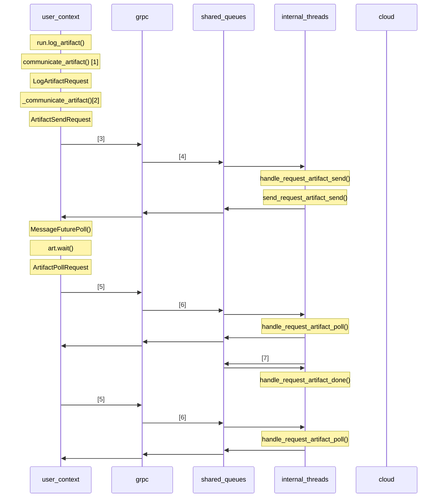

# service artifact

This file describes what happens with the following snippet (after wandb.init()):

```python
wandb.require(experiment="service")
# ...
run = wandb.init()
artifact = wandb.Artifact("my-dataset", type="dataset")
art = run.log_artifact(artifact)
art.wait()
```

## Sequence diagram



Ref | Message/Function | File | Description
--- | --- | --- | ---
1   | `communicate_artifact()`       | [interface.py]   | Online form of log_artifact
2   | `_communicate_artifact()`      | [iface_grpc.py]  | Emulate log_artifact with polling wait
3   | Grpc: ArtifactSend             | [grpc_server.py] | gRPC send artifact to server
4   | `_communicate_artifact_send()` | [interface.py]   | handle GRPC and pass to internal threads
5   | Grpc: ArtifactPoll             | [grpc_server.py] | gRPC poll artifact status
6   | `_communicate_artifact_poll()` | [interface.py]   | handle GRPC and pass polling to handler
7   | `_publish_artifact_done()`     | [interface.py]   | artifact send is done (error or success)

[interface.py]: https://github.com/wandb/wandb/blob/master/wandb/sdk/interface/interface.py
[iface_grpc.py]: https://github.com/wandb/wandb/blob/master/wandb/sdk/interface/iface_grpc.py
[grpc_server.py]: https://github.com/wandb/wandb/blob/master/wandb/sdk/service/grpc_server.py
