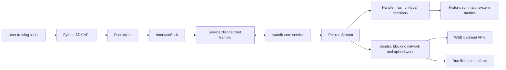

# W&B SDK Architecture Docs

Last audited: 2026-06-10.

This directory is a current, code-grounded onboarding path for engineers and agents working on the W&B SDK. It intentionally treats older decks and Notion pages as historical context. The source of truth is the code in this repository.

## Format

These docs are plain GitHub-flavored Markdown. That is a deliberate choice, not a placeholder:

- Code references are relative links into this repository. GitHub renders them as hyperlinks to the code at the same ref you are browsing, editors make them clickable, and agents can read the target path directly from a checkout. No build step, no link rot against a frozen commit hash.
- Diagrams are Mermaid fences and hand-maintained SVGs, both rendered natively by GitHub.
- References use file paths and symbol names, never line numbers. Symbols survive refactors; line numbers do not. To trace a symbol, search for it in the linked file.

This is intentionally separate from the public W&B docs site. It is for SDK maintainers, contributors, and agents that need an architecture reference tied to the repo.

## Start here

1. [Architecture Overview](architecture.md) - the user process, `wandb-core`, IPC, and the major data paths.
2. [Run Lifecycle And User Flows](run-lifecycle.md) - what happens for `wandb.init()`, `run.log()`, `run.finish()`, files, artifacts, offline sync, and shared core.
3. [wandb-core Internals](wandb-core.md) - the Go service, streams, handler/sender pipeline, transaction log, filestream, file transfer, and Public API routing.
4. [Development Guide](development-guide.md) - practical setup, test strategy, proto generation, and review habits.
5. [Source Map](source-map.md) - the main packages and functions to inspect when changing behavior.

## Visual guide

The docs use maintainable SVG illustrations for the main mental models, then Mermaid diagrams for precise local flows:

- [Architecture map](images/sdk-architecture-map.svg) - the two-process split, IPC, core stream, and backend/durable paths.
- [Run lifecycle journey](images/run-lifecycle-journey.svg) - what a user experiences versus what core continues to do.
- [Core stream pipeline](images/core-stream-pipeline.svg) - handler, transaction log, flow control, sender, and destinations.
- [Source map compass](images/source-map-compass.svg) - where to start when tracing a change through the codebase.

## Mental model

The SDK is split into two cooperating halves:

- The Python package owns the user-facing API: `wandb.init()`, `Run`, settings, config, data type serialization, integration hooks, console capture, and user ergonomics.
- The `wandb-core` sidecar owns the durable and blocking work: run upsert, transaction logging, flow control, file streaming, file transfer, artifact work, system metrics, sync, and newer Public API network calls.

The split exists for product reasons, not just implementation taste:

- User code should not block on slow network and file work for common operations.
- Resource-heavy work should live outside the user process when possible.
- The backend implementation can support more SDK languages through a stable protobuf protocol.
- Operational behavior such as retries, flow control, transaction logs, upload progress, and system metrics can be owned centrally.

## What changed from historical docs

Older architecture material uses names like "frontend/backend", "internal process", and "wandb-service". The current repo still has similar concepts, but the implementation changed substantially:

- `wandb-core` is the default sidecar and is written in Go.
- The old Python service implementation is gone.
- The user process talks to `wandb-core` through `wandb/sdk/lib/service/` and `wandb/sdk/interface/`.
- Go stream processing lives under `core/internal/stream/`.
- Run data persistence uses a transaction log and flow control in `wandb-core`.
- Hardware monitoring uses the Rust `wandb-xpu` binary for accelerator metrics.
- Public API GraphQL calls are being routed through `wandb-core`.

## How to use this as an agent

When changing behavior, start from the user action and trace inward:

1. Find the public Python method on `Run` or the top-level `wandb` module.
2. Find the protobuf `Record` or `Request` emitted by `wandb/sdk/interface/`.
3. Find how `core/pkg/server/connection.go` routes the message.
4. Find the `core/internal/stream` handler or sender path that owns the behavior.
5. Add the narrowest test at the layer where the behavior is meant to be guaranteed.
