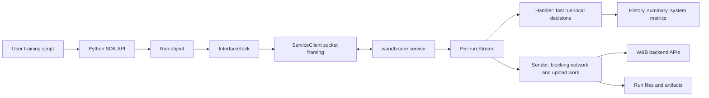

# W&B SDK Architecture Docs

This directory is meant as a current, code-grounded onboarding path for engineers and agents working on the W&B SDK. However, the source of truth is always the code in this repository.

This is intentionally separate from the public W&B docs site. It is for SDK maintainers, contributors, and agents that need an architecture reference tied to the repo.

## Start here

1. [Architecture Overview](architecture.md) - the user process, `wandb-core`, IPC, and the major data paths.
2. [Run Lifecycle And User Flows](run-lifecycle.md) - what happens for `wandb.init()`, `run.log()`, `run.finish()`, files, artifacts, offline sync, and shared core.
3. [wandb-core Internals](wandb-core.md) - the Go service, streams, handler/sender pipeline, transaction log, filestream, file transfer, and Public API routing.
4. [Development Guide](development-guide.md) - practical setup, test strategy, proto generation, and review habits.
5. [Source Map](source-map.md) - the main packages and functions to inspect when changing behavior.

## Visual guide

The docs use maintainable SVG illustrations for the main mental models, then Mermaid diagrams for precise local flows:

- [Architecture map](images/sdk-architecture-map.svg) - the two-process split, IPC, core stream, and backend/durable paths.
- [Run lifecycle journey](images/run-lifecycle-journey.svg) - what a user experiences versus what core continues to do.
- [Core stream pipeline](images/core-stream-pipeline.svg) - handler, transaction log, flow control, sender, and destinations.
- [Source map compass](images/source-map-compass.svg) - where to start when tracing a change through the codebase.

## Mental model

The SDK is split into two cooperating halves:

- The Python package owns the user-facing API: `wandb.init()`, `Run`, settings, config, data type serialization, integration hooks, console capture, and user ergonomics.
- The `wandb-core` sidecar owns the durable and blocking work: run upsert, transaction logging, flow control, data streaming, file transfer, artifact work, system metrics, sync, and newer Public API network calls.

Why a separate process? Keeping `run.log()` off the network hot path only takes background threads, so that alone would not justify a sidecar. The process split buys things a thread cannot:

- One `wandb-core` can serve many client processes. Distributed and multiprocessing workloads can share a single service instead of each spawning their own uploader.
- Work in the sidecar does not compete with training for the Python interpreter. Background threads in pure Python could steal GIL time from the hot loop; serialization, checksumming, and retry bookkeeping in a separate process do not.
- The boundary is a protobuf protocol over a socket. An SDK in another language can get the same upload, retry, and durability behavior by speaking the protocol instead of reimplementing it. Today only the Python SDK does, so treat this one as a bet on the future, however we do have experimental SDKs in C#, Go, and Rust.

Go was chosen for the sidecar because it is convenient for concurrent, server-shaped code: many runs, uploads, and retries map naturally onto goroutines.

## What changed from historical docs

Older architecture material uses names like "frontend/backend", "internal process", and "wandb-service". The current repo still has similar concepts, but the implementation changed substantially:

- `wandb-core`, written in Go, is the only service implementation. You will still hear it called "the internal service" or just "the service" in conversation and older material.
- The old Python service implementation ("the legacy service") is gone. `wandb-core` became the default in 0.18.0 (September 2024) and the legacy path was removed in 0.21.0 (July 2025).
- The user process talks to `wandb-core` through `wandb/sdk/lib/service/` and `wandb/sdk/interface/`.
- Go stream processing lives under `core/internal/stream/`.
- Run data persistence uses a transaction log and flow control in `wandb-core`.
- Hardware monitoring uses the Rust `wandb-xpu` binary for accelerator metrics.
- Public API GraphQL calls are being routed through `wandb-core`.

## How to use this as an agent

When changing behavior, start from the user action and trace inward:

1. Find the public Python method on `Run` or the top-level `wandb` module.
2. Find the protobuf `Record` or `Request` emitted by `wandb/sdk/interface/`.
3. Find how `core/pkg/server/connection.go` routes the message.
4. Find the `core/internal/stream` handler or sender path that owns the behavior.
5. Add the narrowest test at the layer where the behavior is meant to be guaranteed.
