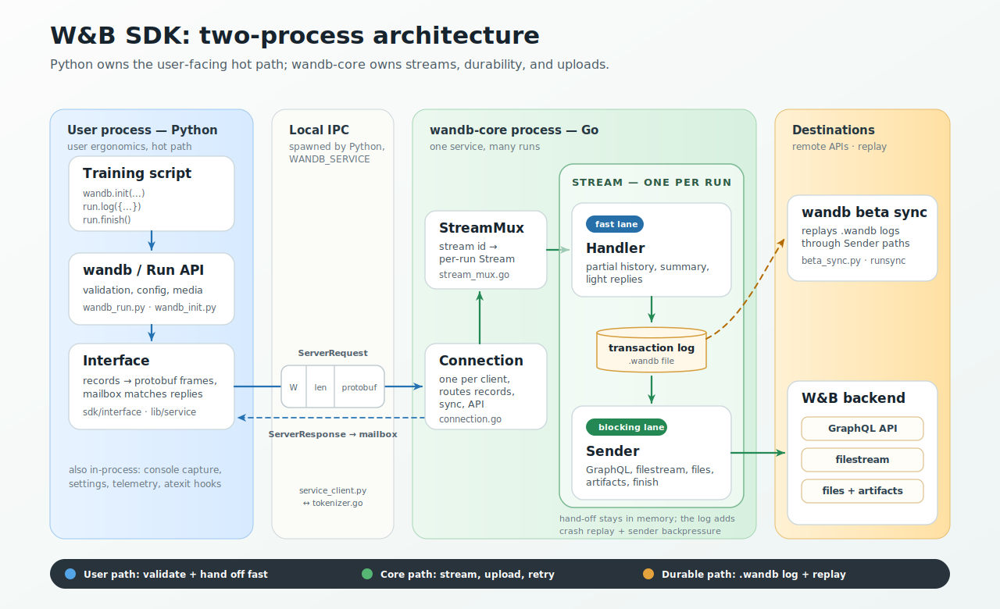
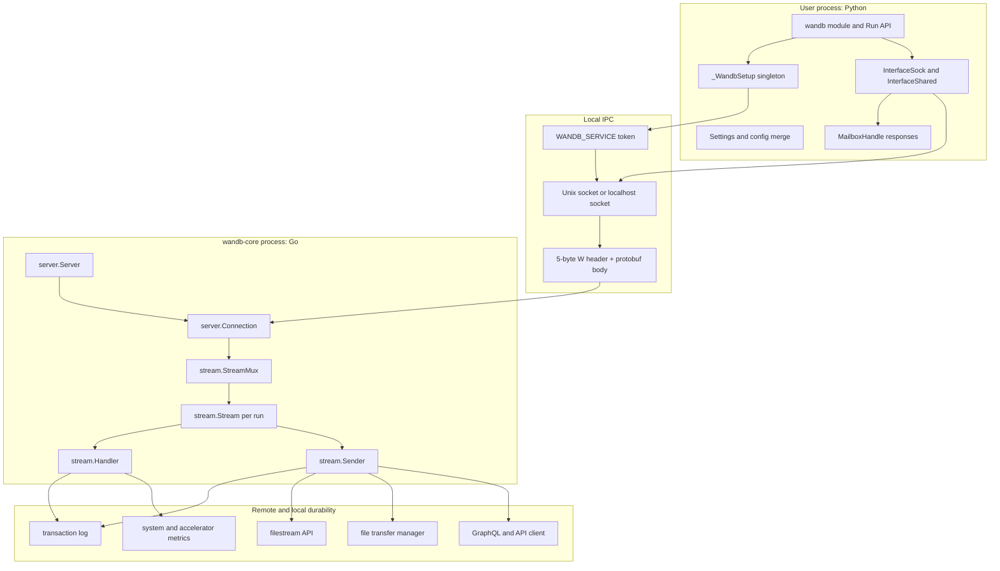
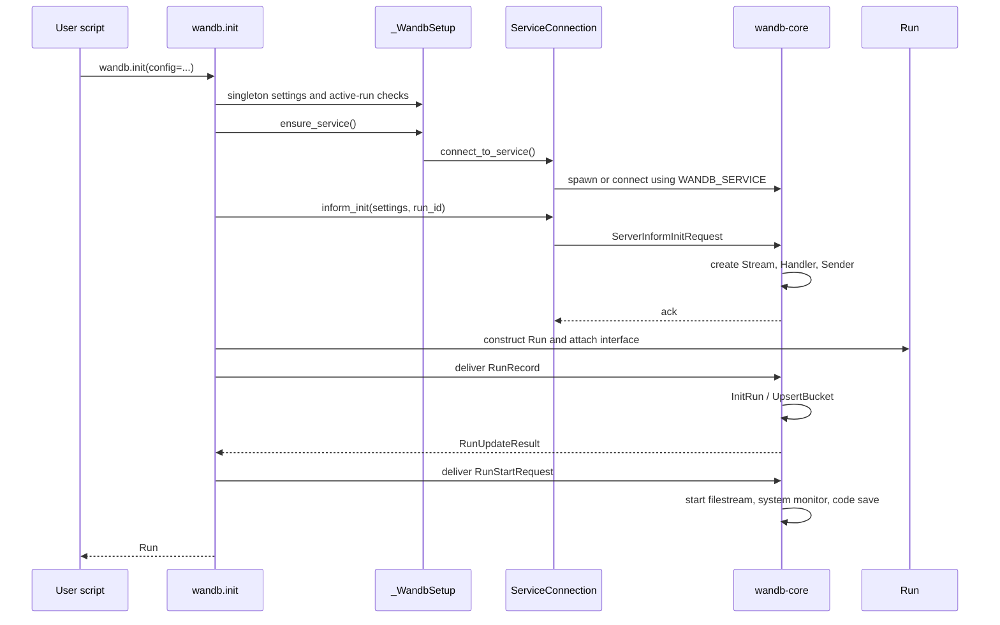
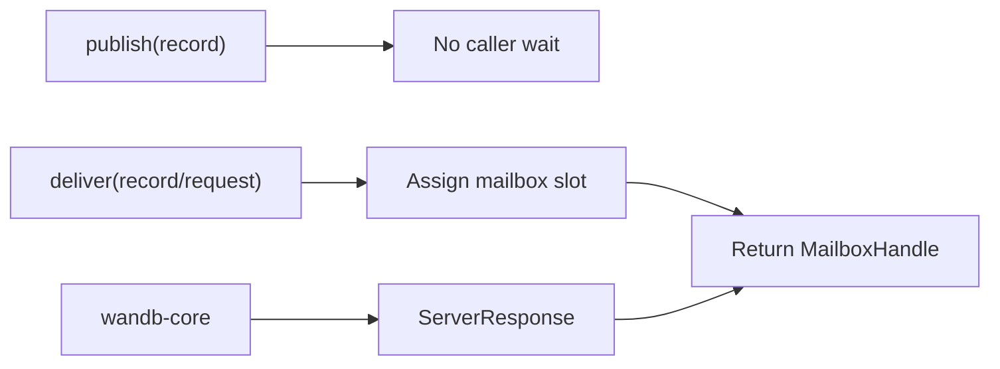

# SDK Architecture Overview

The W&B SDK is a user-facing Python library backed by a local Go sidecar, `wandb-core`. Python presents a small API to training code. Core receives protobuf messages, turns them into per-run work, and owns most network, durability, and upload behavior.



## Architectural goals

- Work transparently from user training scripts and notebooks.
- Keep the user API clean and intuitive.
- Optimize data transport to the W&B backend.
- Integrate with the ML tools users already use.
- Keep expensive and failure-prone work out of the user's hot path.
  - `run.log()` should validate and enqueue data quickly; `wandb-core` should batch, retry, persist, upload, and report progress.

## Components



## Language responsibilities

| Area | Python | Go core | Rust |
| --- | --- | --- | --- |
| User-facing API | `wandb.init`, `Run`, `Config`, `Summary`, media/data types | none | none |
| Settings | Parse public settings, env vars, config files | Convert proto settings to core settings | none |
| IPC | Start/connect to core, frame protobuf messages, wait for responses | Listen, parse frames, route requests | none |
| Run lifecycle | Construct `Run`, send run/init/start/exit records, print progress | Upsert run, manage stream, finish upload work | none |
| History and summary | Serialize user values to proto items | Accumulate partial history, derive summary, stream JSONL | none |
| Files | Materialize `run.save()` paths into run files dir | Watch, schedule, upload, report progress | none |
| Artifacts | User object model and API ergonomics | Save/link/download artifact work | none |
| System metrics | Settings and callbacks | System monitor orchestration | `wandb-xpu` accelerator collectors |
| Public API | Python object model | GraphQL/API network calls | `parquet` (history) data handling |

## Key code references

- Python singleton and service connection: [`wandb/sdk/wandb_setup.py`](../../wandb/sdk/wandb_setup.py)
- `wandb.init()` implementation: [`wandb/sdk/wandb_init.py`](../../wandb/sdk/wandb_init.py)
- User-facing `Run`: [`wandb/sdk/wandb_run.py`](../../wandb/sdk/wandb_run.py)
- Python service client: [`wandb/sdk/lib/service/service_connection.py`](../../wandb/sdk/lib/service/service_connection.py)
- Socket framing: [`wandb/sdk/lib/service/service_client.py`](../../wandb/sdk/lib/service/service_client.py)
- Interface-to-protobuf bridge: [`wandb/sdk/interface/interface.py`](../../wandb/sdk/interface/interface.py), [`wandb/sdk/interface/interface_sock.py`](../../wandb/sdk/interface/interface_sock.py)
- Protobuf schemas: [`wandb/proto`](../../wandb/proto)
- Core entrypoint: [`core/cmd/wandb-core/main.go`](../../core/cmd/wandb-core/main.go)
- Core server and connection: [`core/pkg/server`](../../core/pkg/server)
- Per-run stream: [`core/internal/stream`](../../core/internal/stream)

## Current init sequence



The important Python snippet is in `_WandbInit.init()`:

```python
service = self._wl.ensure_service()
interface = service.inform_init(
    settings=settings.to_proto(),
    run_id=settings.run_id,
)
run = Run(config=..., settings=settings, ...)
run._set_backend(interface)
run_init_handle = interface.deliver_run(run)
run_start_handle = interface.deliver_run_start(run)
```

Core receives the `inform_init`, injects a stream, starts it, and responds. Regular run records then flow through `handleInformRecord()` into that stream.

## Message model

There are three nested concepts that are easy to confuse:

- `ServerRequest`: an outer envelope used on the Python-to-core socket. It contains control requests like `inform_init`, `sync`, `api_request`, or a run `record_publish`.
- `Record`: the per-run protobuf message, defined in `wandb_internal.proto`, used for history, summary, config, files, artifacts, output, exit, and request messages. Persisted in the transaction log.
- `Request`: a `Record` subtype that expects a run-level response, such as `RunStart`, `PartialHistory`, `PollExit`, `GetSummary`, or artifact operations. Not persisted in the transaction log.

`publish` means "send and do not wait for a response". `deliver` means "send and return a mailbox handle for the response".



## Data paths

| User action | Python emits | Core owner | Backend/local effect |
| --- | --- | --- | --- |
| `wandb.init()` | `RunRecord`, `RunStartRequest` | `runupserter`, `Handler`, `Sender` | Upsert run, start filestream and monitors |
| `run.log()` | `PartialHistoryRequest` | `Handler` then `Sender` | Accumulate/flush history, update summary, stream JSONL |
| `run.summary[...] = ...` | `SummaryRecord` | `Sender` | Update summary and stream `wandb-summary.json` data |
| `run.save()` | `FilesRecord` | `runfiles.Uploader` | Watch/link/copy files, upload by policy |
| `run.log_artifact()` | `ArtifactRecord` or artifact request | `ArtifactSaveManager` | Upload artifact manifest and files |
| `run.finish()` | `RunExitRecord` | `Sender.finishRunSync` | Flush logs, summary, config, artifacts, files, filestream exit |
| `wandb beta sync` | `ServerInitSyncRequest`, `ServerSyncRequest` | `runsync.RunSyncManager` | Replay `.wandb` transaction log |

## What not to assume

- Do not assume the old Python service exists. Current service startup is in `wandb/sdk/lib/service/service_process.py`.
- Do not assume all network traffic still happens from Python. Public API traffic routes through `wandb-core`.
- Do not assume `run.log()` directly makes HTTP requests. It publishes records and core handles transport.
- Do not assume offline mode bypasses core. Offline runs still use core for local run processing; they skip remote filestream/API work.
- Do not assume line-numbered docs stay valid. Prefer symbol and file references in durable docs.
