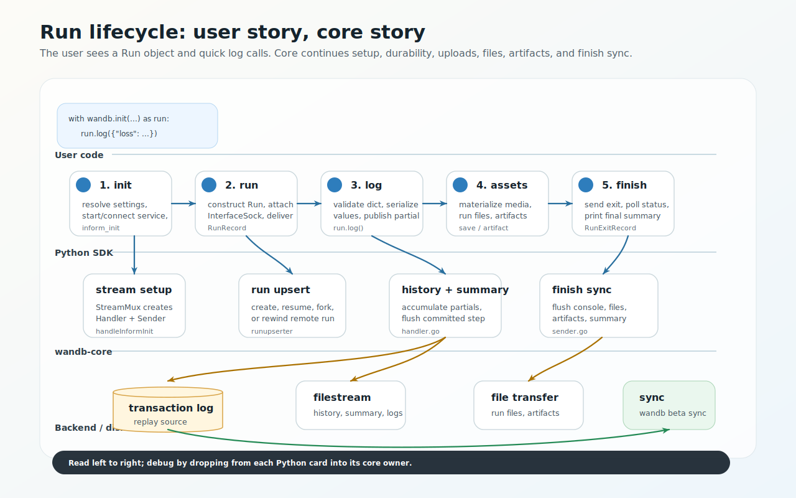
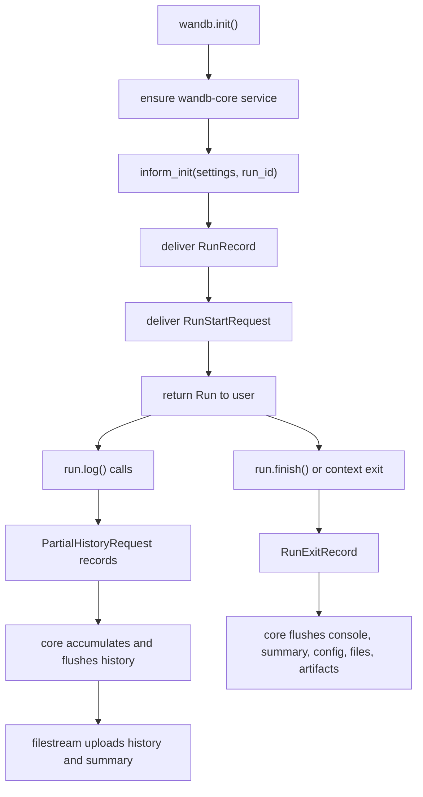
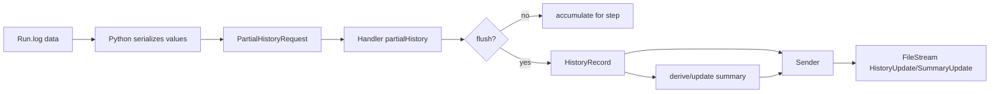
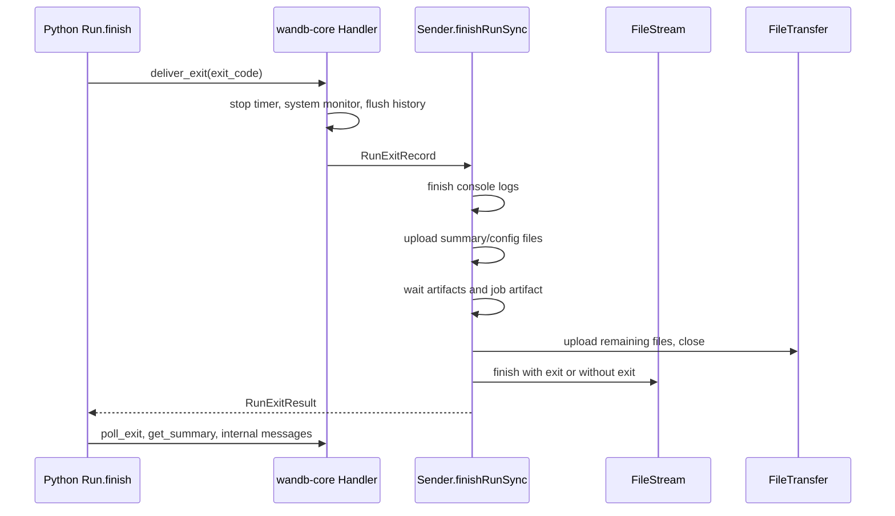
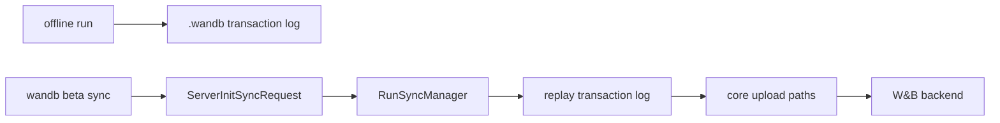

# Run Lifecycle And User Flows

This page follows common user-facing flows inward from public API call to core behavior.



## Minimal run

User code:

```python
import wandb

with wandb.init(project="demo", config={"lr": 1e-3}) as run:
    for step in range(3):
        run.log({"loss": 1 / (step + 1), "step": step})
```

High-level flow:



## `wandb.init()`

Primary code:

- [`wandb/sdk/wandb_init.py`](../../wandb/sdk/wandb_init.py) - `_WandbInit.init`
- [`wandb/sdk/wandb_setup.py`](../../wandb/sdk/wandb_setup.py) - `_WandbSetup.ensure_service`
- [`wandb/sdk/lib/service/service_connection.py`](../../wandb/sdk/lib/service/service_connection.py) - `connect_to_service`, `inform_init`
- [`core/pkg/server/connection.go`](../../core/pkg/server/connection.go) - `handleInformInit`
- [`core/internal/stream/stream.go`](../../core/internal/stream/stream.go) - `Stream.Start`
- [`core/internal/runupserter`](../../core/internal/runupserter) - first `RunRecord` handling

What Python does:

1. Checks active runs and `reinit` behavior.
2. Starts or reuses `wandb-core`.
3. Sends `ServerInformInitRequest` to create a core stream for this run ID.
4. Constructs the `Run` object and attaches an `InterfaceSock`.
5. Publishes a header record.
6. Delivers a `RunRecord` and waits for `RunUpdateResult`.
7. Delivers `RunStartRequest`.
8. Starts console capture, status checks, telemetry, and returns control to user code.

What core does:

1. Creates a `Stream` via dependency injection.
2. Starts a `Handler` goroutine and a `Sender` goroutine.
3. Handles the first `RunRecord` as `RunUpdateWork`.
4. Creates or resumes/forks/rewinds the run using the GraphQL client unless offline.
5. Starts filestream, system metrics, and code/patch capture after `RunStartRequest`.

## `run.log()`

Primary code:

- [`wandb/sdk/wandb_run.py`](../../wandb/sdk/wandb_run.py) - `Run.log`, `Run._log`, `_partial_history_callback`
- [`wandb/sdk/interface/interface.py`](../../wandb/sdk/interface/interface.py) - `publish_partial_history`
- [`core/internal/stream/handler.go`](../../core/internal/stream/handler.go) - `handleRequestPartialHistory`, `flushPartialHistory`
- [`core/internal/stream/sender.go`](../../core/internal/stream/sender.go) - `sendHistory`, `sendSummary`
- [`core/internal/runhistory`](../../core/internal/runhistory) and [`core/internal/runsummary`](../../core/internal/runsummary)
- [`core/internal/filestream`](../../core/internal/filestream)

Python validates that `log()` receives a dictionary with string keys, serializes values into history items, and publishes a `PartialHistoryRequest`.

```python
self._interface.publish_partial_history(
    self,
    data,
    user_step=self._local_step,
    step=step,
    flush=commit,
    publish_step=not_using_tensorboard,
)
```

Core keeps the current partial history step in the handler. In normal mode, `commit=True` or implicit commit flushes a `HistoryRecord`. In shared mode, core avoids relying on each client to assign a globally monotonic step.



Step rules to remember:

- Without an explicit `step`, Python tracks a local `_local_step`.
- `commit=False` accumulates metrics for the current step.
- `commit=True` or the default commit path flushes and advances.
- In multiprocessing or attached runs, setting step manually can lose data; prefer `define_metric()` for custom x-axes.
- Shared mode changes step ownership because multiple independent writers cannot safely coordinate a single monotonic client-side counter.

## `run.finish()`

Primary code:

- [`wandb/sdk/wandb_run.py`](../../wandb/sdk/wandb_run.py) - `Run.finish`, `_finish`, `_atexit_cleanup`, `_on_finish`
- [`wandb/sdk/interface/interface.py`](../../wandb/sdk/interface/interface.py) - `deliver_exit`, `deliver_poll_exit`, `deliver_get_summary`
- [`core/internal/stream/handler.go`](../../core/internal/stream/handler.go) - `handleExit`
- [`core/internal/stream/sender.go`](../../core/internal/stream/sender.go) - `sendExit`, `finishRunSync`

Finish is both a user API and a synchronization point. It should not return until core has either uploaded what it can or recorded that finish timed out.

Core finish order matters:

1. Stop console log producers.
2. Upload the finalized summary.
3. Finish run upserter metadata updates, then upload the final config.
4. Wait for artifact operations.
5. Save the job artifact if needed.
6. Stop file watching.
7. Upload remaining run files.
8. Close file transfer manager.
9. Finish filestream, optionally marking the run complete.
10. Mark file transfer stats done and close printer messages.



## Files: `run.save()`

Primary code:

- [`wandb/sdk/wandb_run.py`](../../wandb/sdk/wandb_run.py) - `Run.save`, `Run._save`
- [`wandb/sdk/interface/interface.py`](../../wandb/sdk/interface/interface.py) - `publish_files`
- [`core/internal/runfiles`](../../core/internal/runfiles)
- [`core/internal/filetransfer`](../../core/internal/filetransfer)

Python expands the glob immediately, materializes matching files under the run files directory using symlink, hardlink, or copy, then publishes a `FilesRecord` with a policy:

- `now` uploads once.
- `live` uploads now and watches for changes.
- `end` uploads during finish.

Core's `runfiles.Uploader` owns watching, batching GraphQL file metadata calls, and creating file transfer tasks. `FileTransferManager` limits concurrent transfers and waits for all tasks on close.

## Artifacts

Primary code:

- [`wandb/sdk/wandb_run.py`](../../wandb/sdk/wandb_run.py) - `use_artifact`, `log_artifact`, `_log_artifact`
- [`wandb/sdk/artifacts`](../../wandb/sdk/artifacts)
- [`core/pkg/artifacts`](../../core/pkg/artifacts)
- [`core/internal/stream/sender.go`](../../core/internal/stream/sender.go) - `sendArtifact`, artifact request handlers

Python owns the rich `Artifact` object model and validates user input. Core owns long-running save/link/download work. Online artifact logging uses a mailbox handle so callers can wait on artifact completion. Offline artifact logging publishes without waiting for remote completion.

## Offline and sync

Offline runs still use the SDK architecture; they skip online upload paths and write local run state. The transaction log is the durable replay source for sync.

There are currently two sync CLI paths. `wandb beta sync` is the core-backed implementation described here: it asks `wandb-core` to replay the `.wandb` transaction log through the normal upload paths. Plain `wandb sync` is still the older Python implementation in [`wandb/cli/cli.py`](../../wandb/cli/cli.py).

Primary code:

- [`core/internal/transactionlog`](../../core/internal/transactionlog)
- [`core/internal/runsync`](../../core/internal/runsync)
- [`wandb/sdk/lib/service/service_connection.py`](../../wandb/sdk/lib/service/service_connection.py) - `init_sync`, `sync`, `sync_status`
- [`wandb/cli/beta_sync.py`](../../wandb/cli/beta_sync.py)



## Detached or shared `wandb-core`

Normally the Python process starts and owns a `wandb-core` child process. If `WANDB_SERVICE` is already set, the SDK connects to an existing service and does not shut it down when the run finishes.

Primary code:

- [`wandb/sdk/lib/service/service_connection.py`](../../wandb/sdk/lib/service/service_connection.py) - `connect_to_service`
- [`wandb/sdk/lib/service/service_process.py`](../../wandb/sdk/lib/service/service_process.py) - `start`, `start_detached`
- [`wandb/cli/beta_core.py`](../../wandb/cli/beta_core.py)

Use cases:

- Multi-process workloads that should share one sidecar.
- Explicit local service management through `wandb beta core start` and `wandb beta core stop`.
- Debugging service lifetime independent of a single user process.
