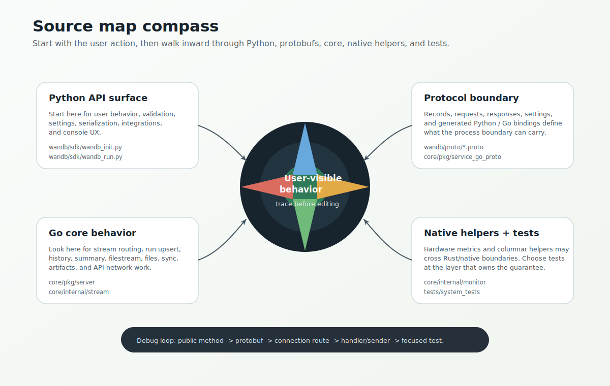

# SDK Source Map

This page maps concepts to code. It is meant for navigation, not exhaustive ownership.



## Python package

| Path | Why it matters |
| --- | --- |
| [`wandb/__init__.py`](../../wandb/__init__.py) | Public module import surface. |
| [`wandb/sdk/wandb_init.py`](../../wandb/sdk/wandb_init.py) | Main `wandb.init()` flow. |
| [`wandb/sdk/wandb_run.py`](../../wandb/sdk/wandb_run.py) | `Run`, `log`, `finish`, `save`, artifacts, console capture, telemetry hooks. |
| [`wandb/sdk/wandb_setup.py`](../../wandb/sdk/wandb_setup.py) | Per-process singleton, active run stack, service connection. |
| [`wandb/sdk/wandb_settings.py`](../../wandb/sdk/wandb_settings.py) | Settings model and validation. |
| [`wandb/sdk/interface/interface.py`](../../wandb/sdk/interface/interface.py) | Converts high-level Python events into protobuf records. |
| [`wandb/sdk/interface/interface_sock.py`](../../wandb/sdk/interface/interface_sock.py) | Assigns stream IDs and sends records over `ServiceClient`. |
| [`wandb/sdk/lib/service/service_connection.py`](../../wandb/sdk/lib/service/service_connection.py) | Starts/connects to core and sends outer `ServerRequest`s. |
| [`wandb/sdk/lib/service/service_client.py`](../../wandb/sdk/lib/service/service_client.py) | Socket framing and response forwarding. |
| [`wandb/sdk/mailbox`](../../wandb/sdk/mailbox) | Request/response matching for calls that wait on core. |
| [`wandb/sdk/artifacts`](../../wandb/sdk/artifacts) | Python artifact object model. |
| [`wandb/apis/public/service_api.py`](../../wandb/apis/public/service_api.py) | Public API calls routed through core. |

## Go core

| Path | Why it matters |
| --- | --- |
| [`core/cmd/wandb-core/main.go`](../../core/cmd/wandb-core/main.go) | Core process entrypoint and flags. |
| [`core/pkg/server/server.go`](../../core/pkg/server/server.go) | Top-level server, listeners, stream mux, sync manager. |
| [`core/pkg/server/connection.go`](../../core/pkg/server/connection.go) | Socket connection, request routing, responses. |
| [`core/pkg/server/tokenizer.go`](../../core/pkg/server/tokenizer.go) | Frame scanner for `W` + length protocol. |
| [`core/internal/stream/stream.go`](../../core/internal/stream/stream.go) | Per-run stream and pipeline startup. |
| [`core/internal/stream/handler.go`](../../core/internal/stream/handler.go) | Fast run-local handling, partial history, summary, system monitor, exit. |
| [`core/internal/stream/sender.go`](../../core/internal/stream/sender.go) | Blocking upload/network work and finish synchronization. |
| [`core/internal/stream/recordparser.go`](../../core/internal/stream/recordparser.go) | Converts records to work implementations. |
| [`core/internal/runwork`](../../core/internal/runwork) | Work and request abstraction between handler/sender. |
| [`core/internal/runupserter`](../../core/internal/runupserter) | Run creation/update, config, telemetry, metrics, resume/fork/rewind. |
| [`core/internal/runhistory`](../../core/internal/runhistory) | Per-step metric data. |
| [`core/internal/runsummary`](../../core/internal/runsummary) | Summary state and derived metric summaries. |
| [`core/internal/filestream`](../../core/internal/filestream) | Streaming history/events/output/summary to backend. |
| [`core/internal/runfiles`](../../core/internal/runfiles) | `run.save()` and internal run file upload scheduling. |
| [`core/internal/filetransfer`](../../core/internal/filetransfer) | Upload/download task execution and concurrency. |
| [`core/pkg/artifacts`](../../core/pkg/artifacts) | Artifact save/download/link behavior. |
| [`core/internal/runsync`](../../core/internal/runsync) | `wandb beta sync` operation management. |
| [`core/internal/wbapi`](../../core/internal/wbapi) | Public API handlers inside core. |
| [`core/internal/monitor`](../../core/internal/monitor) | System metrics orchestration. |

## Rust and native helpers

| Path | Why it matters |
| --- | --- |
| [`xpu`](../../xpu) | `wandb-xpu`, hardware accelerator metric collection. |
| [`parquet-rust-wrapper`](../../parquet-rust-wrapper) | Rust Arrow/Parquet FFI library (`librust_parquet_ffi`) bundled under `wandb/bin/`. |

## Protobufs

| Path | Why it matters |
| --- | --- |
| [`wandb/proto/wandb_internal.proto`](../../wandb/proto/wandb_internal.proto) | Run `Record`, `Request`, `Response` schemas. |
| [`wandb/proto/wandb_server.proto`](../../wandb/proto/wandb_server.proto) | Outer service `ServerRequest` and `ServerResponse` schemas. |
| [`wandb/proto/wandb_settings.proto`](../../wandb/proto/wandb_settings.proto) | Settings shared with core. |
| [`wandb/proto/wandb_api.proto`](../../wandb/proto/wandb_api.proto) | Public API routing through core. |
| [`wandb/proto/wandb_sync.proto`](../../wandb/proto/wandb_sync.proto) | `wandb beta sync` messages. |
| [`core/pkg/service_go_proto`](../../core/pkg/service_go_proto) | Generated Go protobuf stubs. |

## Code snippets worth knowing

Service connection selection:

```python
token = service_token.from_env()
if token:
    return ServiceConnection(asyncer=asyncer, client=token.connect(asyncer=asyncer), proc=None)
else:
    return _start_and_connect_service(asyncer, settings)
```

Socket frame write:

```python
header = struct.pack("<BI", ord("W"), request.ByteSize())
self._writer.write(header)
self._writer.write(request.SerializeToString())
```

Core request routing (abridged; the full switch also covers attach, authenticate, cancel, finish, sync status, and teardown):

```go
switch x := msg.ServerRequestType.(type) {
case *spb.ServerRequest_InformInit:
    nc.handleInformInit(msg.RequestId, x.InformInit)
case *spb.ServerRequest_RecordPublish:
    nc.handleInformRecord(msg.RequestId, x.RecordPublish)
case *spb.ServerRequest_Sync:
    nc.handleSync(wg, msg.RequestId, x.Sync)
case *spb.ServerRequest_ApiRequest:
    nc.handleApi(wg, msg.RequestId, x.ApiRequest)
// ...
}
```

Stream startup:

```go
go func() { s.handler.Do(s.runWork.Chan()); s.wg.Done() }()
maybeSavedWork := s.maybeSavingToTransactionLog(s.handler.OutChan())
go func() { s.sender.Do(maybeSavedWork); s.wg.Done() }()
```

Sender finish order is intentionally staged (abridged from `finishRunSync`):

```go
s.consoleLogsSender.Finish()
s.uploadSummaryFile()
upserter.Finish()
s.uploadConfigFile()
s.artifactWG.Wait()
s.sendJobFlush()
s.fileWatcher.Finish()
s.runfilesUploader.UploadRemaining()
s.runfilesUploader.Finish()
s.fileTransferManager.Close()
s.fileStream.FinishWithExit(exitRecord.ExitCode)
s.fileTransferStats.SetDone()
s.printer.Close()
```

## Navigation recipes

### I need to change `run.log()`

1. Start in `Run.log` and `_partial_history_callback`.
2. Check `Interface.publish_partial_history`.
3. Check handler partial history logic.
4. Check `runhistory`, `runsummary`, and sender `sendHistory`.
5. Test both default commit and `commit=False` if behavior touches steps.

### I need to change service startup

1. Start in `ServiceConnection.connect_to_service`.
2. Check token parsing and `WANDB_SERVICE`.
3. Check `service_process.start` and detached startup.
4. Check core flags in `serviceMain`.
5. Test owned service and externally managed service.

### I need to change finish behavior

1. Start in `Run._on_finish`.
2. Check `deliver_exit`, `PollExit`, and final summary fetch.
3. Check handler `handleExit`.
4. Check sender `finishRunSync`.
5. Be very careful with producer-before-consumer shutdown ordering.

### I need to change files or artifacts

For run files:

1. `Run.save`
2. `Interface.publish_files`
3. `runfiles.Uploader`
4. `filetransfer.FileTransferManager`

For artifacts:

1. `Run.log_artifact` or `Run.use_artifact`
2. Python artifact object methods.
3. Interface artifact publish/deliver.
4. Sender artifact cases and `core/pkg/artifacts`.

### I need to change offline sync

1. `wandb/cli/beta_sync.py`
2. `ServiceConnection.init_sync`, `sync`, `sync_status`
3. `core/internal/runsync`
4. `core/internal/transactionlog`

## Glossary

- User process: the Python process running user training code.
- Core: the `wandb-core` sidecar process.
- Service: usually means the local `wandb-core` service. Avoid using it for the remote W&B backend.
- Backend: ambiguous. Prefer "W&B backend" for the remote service and "core" for the local sidecar.
- Stream: core's per-run processing pipeline.
- Record: protobuf message that mutates or queries run state.
- Request: record subtype or outer service request that expects a response.
- Mailbox: request/response matcher for responses from core.
- Filestream: remote API for run history, events, console output, and summary.
- Run files: files in a run's files directory, including `run.save()` output and internal files.
- Artifacts: versioned, manifest-based inputs/outputs; separate from run files.
