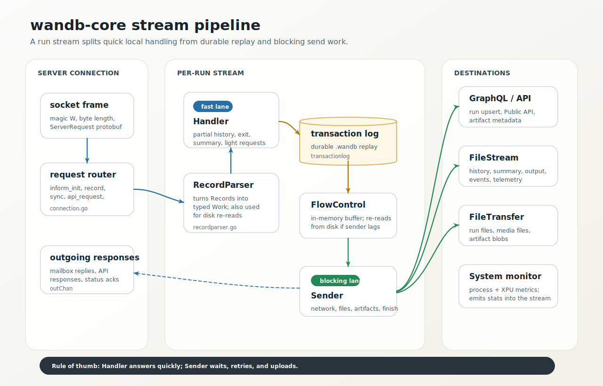
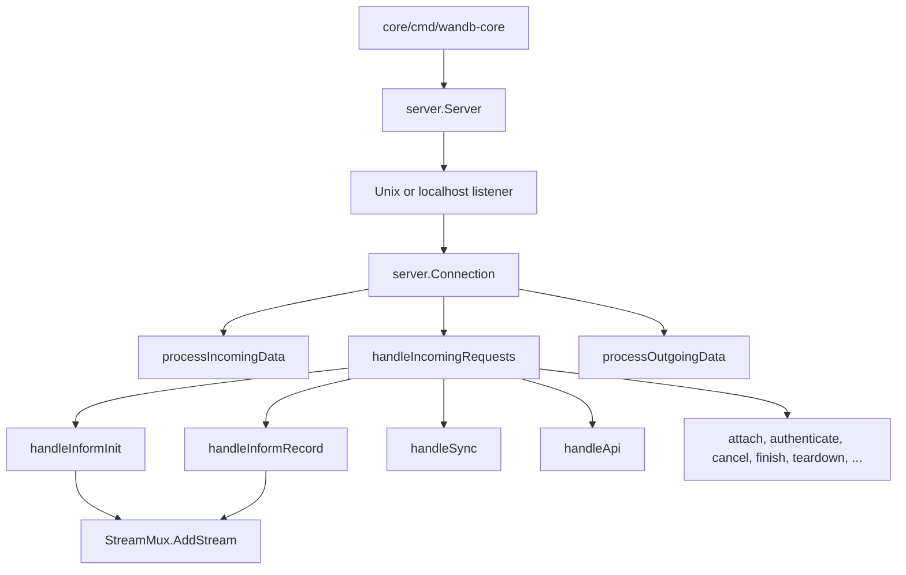
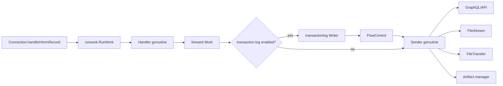
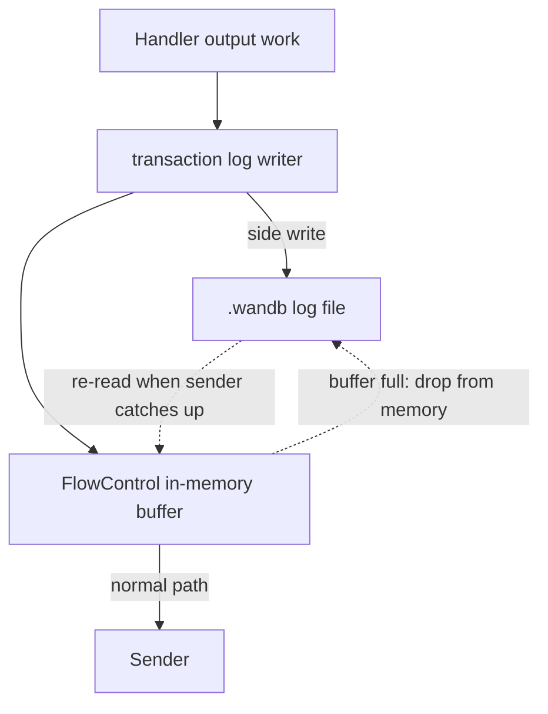
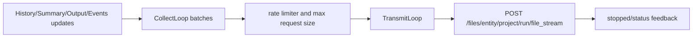

# wandb-core Internals

`wandb-core` is the Go sidecar process that receives SDK protobuf messages, manages one or more run streams, and owns most blocking or durable work.



## Process startup

Python starts core through [`wandb/sdk/lib/service/service_process.py`](../../wandb/sdk/lib/service/service_process.py):

```python
core_path = get_core_path()
service_args.append(core_path)
service_args.extend(["--port-filename", str(port_file)])
service_args.extend(["--pid", pid])
proc = subprocess.Popen(service_args, ...)
token = service_port_file.poll_for_token(port_file, proc, ...)
```

`get_core_path()` resolves the bundled binary under `wandb/bin/wandb-core`. The service writes a connection token to a temporary port file. Python saves that token into `WANDB_SERVICE` so child processes can connect to the same service.

Core starts at [`core/cmd/wandb-core/main.go`](../../core/cmd/wandb-core/main.go). The default subcommand calls `serviceMain()`, configures observability, creates a `server.Server`, and calls `Serve(portFilename)`. The same binary also hosts the `leet` subcommand, which backs the `wandb leet` terminal UI under [`core/internal/leet`](../../core/internal/leet).

## IPC framing

Python and Go use the same simple frame:

```text
+--------+-------------------+------------------------+
| magic  | uint32 byte size  | protobuf payload       |
| 'W'    | little-endian     | ServerRequest/Response |
+--------+-------------------+------------------------+
```

Python writes it in [`ServiceClient._send_server_request`](../../wandb/sdk/lib/service/service_client.py). Go reads it with [`ScanWBRecords`](../../core/pkg/server/tokenizer.go) and writes responses in `Connection.processOutgoingData`.

This is intentionally boring. The protocol complexity belongs in protobuf messages, not in the transport.

## Server and connection



The diagram shows the main routes; the full `switch` in `handleIncomingRequests` covers every `ServerRequest` variant, including attach, authenticate, cancel, sync status, and teardown.

`server.Server` owns shared process-wide resources:

- `StreamMux`: stream ID to per-run stream.
- `RunSyncManager`: `wandb beta sync` operations.
- `XPUResourceManager`: expensive accelerator metric resources.
- Listener and connection lifetime.

`server.Connection` owns one socket connection. It runs three goroutines:

- Incoming data reader.
- Request router.
- Outgoing response writer.

Requests that need cancellation use `RequestCanceller`; responses flow back through `outChan`.

## Stream pipeline

A stream is the per-run core pipeline. It is created by `stream.InjectStream()` from [`core/internal/stream/streaminject.go`](../../core/internal/stream/streaminject.go). The injection set wires together filestream, file transfer, run files, monitor, mailbox, run handle, sender, handler, tensorboard handling, and flow control.



`Handler` is for fast decisions and local state:

- Partial history accumulation and flush decisions.
- Metric definitions and summary derivation used for immediate responses.
- Run start handling, system monitor start, code and patch save.
- Exit handling, history flush, system monitor finish.
- Responding to lightweight requests such as `PollExit`, `GetSummary`, and internal messages.

`Sender` is for blocking work:

- Run files and artifact uploads.
- Filestream history, events, output, and summary.
- GraphQL and API calls.
- Finish synchronization.
- Job artifact creation.

## Transaction log and flow control

`Stream.maybeSavingToTransactionLog()` inserts two stages between `Handler` and `Sender` unless settings skip the log: a `transactionlog` writer that persists every record to the `.wandb` file as it passes through, and a `FlowControl` buffer that forwards work to the sender.

The important subtlety: work normally flows to the sender in memory. The disk write is a side effect, not a round trip. `FlowControl` holds a small in-memory buffer (see `FlowControlParams` in `flowcontrolbuffer.go`, sized in `stream.go`); only when the sender falls behind and the buffer fills does it discard saved work from memory and re-read it from the log later, re-parsing records through `RecordParser`.

Why this exists:

- If the process crashes, there is a durable replay source.
- It creates backpressure before unbounded in-memory queues can grow.
- It decouples quick user-process handoff from slower network work.



The TODOs in this area are real. Some records are still handled in older "legacy style" in handler/sender switch statements. When changing a record type, look for both direct handler/sender cases and `RecordParser.Parse()`.

## Run upsert

The first `RunRecord` becomes `RunUpdateWork` in [`core/internal/stream/recordparser.go`](../../core/internal/stream/recordparser.go). `RunUpdateWork` initializes a `RunUpserter` if one does not exist.

`RunUpserter` owns run metadata that changes rarely:

- Run params, entity/project/run ID, display name.
- Config.
- Telemetry.
- Metric definitions.
- Environment info.
- Resume, fork, and rewind metadata.

It debounces `UpsertBucket` updates to avoid excessive network calls.

## History and summary

History is a set of metric values for one step. Summary is a derived or explicit view of the latest and configured metric summaries.

Core packages:

- [`core/internal/runhistory`](../../core/internal/runhistory)
- [`core/internal/runsummary`](../../core/internal/runsummary)
- [`core/internal/runmetric`](../../core/internal/runmetric)

`run.log()` emits `PartialHistoryRequest`; the handler accumulates those into `HistoryRecord`s. The sender streams them through `filestream.HistoryUpdate`.

The history JSON uses an extended JSON representation that can represent values like `NaN` and infinities.

## Filestream

Filestream is the run-data stream to the backend. It handles:

- `wandb-history.jsonl`
- `output.log`
- `wandb-events.jsonl`
- `wandb-summary.json`
- heartbeats
- backend stop feedback

Core package: [`core/internal/filestream`](../../core/internal/filestream).



Filestream requests retry for a long window because experiments may run for days and users may have transient network failures.

## Run files and file transfer

`run.save()` and internal files use the run files path, separate from artifacts. The Python side materializes files into the run directory and sends `FilesRecord`s. Core's `runfiles.Uploader` handles policies and uses `FileTransferManager` for actual transfers.

Core packages:

- [`core/internal/runfiles`](../../core/internal/runfiles)
- [`core/internal/filetransfer`](../../core/internal/filetransfer)
- [`core/internal/watcher`](../../core/internal/watcher)

The file transfer manager limits concurrent transfers with a semaphore and waits for all tasks in `Close()`.

## Artifacts

Artifacts have richer lifecycle semantics than run files. Python owns the user object model; core owns save/link/download work once requests reach the sidecar.

Core artifact work is mostly under:

- [`core/pkg/artifacts`](../../core/pkg/artifacts)
- [`core/pkg/launch`](../../core/pkg/launch) for job artifacts
- Sender artifact cases in [`core/internal/stream/sender.go`](../../core/internal/stream/sender.go)

## System metrics and XPU

The handler starts the system monitor after run start and stops it during exit. The monitor writes stats records into the same stream.

Core packages:

- [`core/internal/monitor`](../../core/internal/monitor)
- [`xpu`](../../xpu) for Rust accelerator metric collection

Process isolation for accelerator monitoring matters. Treat direct GPU/TPU library access as a reliability-sensitive boundary.

## Public API through core

`wandb.Api` GraphQL operations route through `wandb-core`. Python initializes an API session with `api_init_request`, sends `api_request`, and receives `api_response`.

Primary code:

- [`wandb/apis/public/service_api.py`](../../wandb/apis/public/service_api.py)
- [`wandb/sdk/lib/service/service_connection.py`](../../wandb/sdk/lib/service/service_connection.py)
- [`core/internal/wbapi`](../../core/internal/wbapi)
- `handleApiInit`, `handleApi`, and `handleApiCleanup` in [`core/pkg/server/connection.go`](../../core/pkg/server/connection.go)

API failures surface as `WandbApiFailedError` rather than raw `requests` exceptions.

## Debugging checklist

When a run behavior is surprising:

0. If possible, turn on debug logging with `WANDB_DEBUG=true`.
1. Check user-process logs first: `debug.log`.
2. Check core logs: `debug-core.log`.
3. Identify the record emitted by Python.
4. Confirm whether the record reached `Connection.handleInformRecord`.
5. Confirm whether `Handler` forwarded it and whether `Sender` processed it.
6. For upload issues, check filestream request summaries and file transfer stats.
7. For finish hangs, inspect operation stats returned by `PollExit`.
8. For offline/sync, inspect the transaction log path and `runsync` messages.
