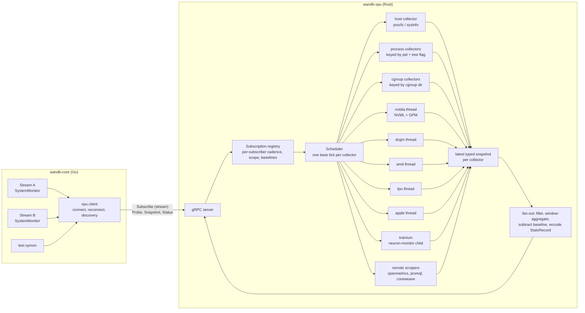

# wandb-xpu as the system telemetry service

Status: proposal. Owner: SDK team. Scope: `core/internal/monitor`, `xpu`, `wandb/proto/wandb_system_monitor.proto`.

## Decisions in one screen

| Question | Decision |
| --- | --- |
| Move all system monitoring from wandb-core to wandb-xpu? | Yes. Every collector moves. wandb-core keeps only what is not monitoring: settings-derived environment fields, the CoreWeave GraphQL gate, the per-run `_system_metrics` buffer, and label suffixing. |
| Keep the name `xpu`? | Yes. Keep the binary name `wandb-xpu`; redefine it as "system telemetry for any processing unit". Rename only the internal Rust trait (`GpuMonitor` to `Collector`). |
| Client model | Replace per-run polling (`GetStats`) with subscriptions. The service owns the sampling clock, samples each source once per tick, and fans out per subscriber. |
| Different sampling intervals per run | Allowed. Each collector ticks at a base period derived from its subscribers; each subscriber is delivered on its own multiple of that period. The effective interval is reported back. |
| Topology | Phases 1 to 3: one service per wandb-core, as today. Phase 4: one shared daemon per node and user, discovered through a fixed socket, behind a setting until proven. The protocol is identical in both modes. |

## 1. Why the current model does not scale

### 1.1 What happens today for one run

`SystemMonitor` (`core/internal/monitor/monitor.go`) runs one ticker per run stream. On every tick it calls `Sample()` on each `Resource` in a goroutine. The `XPU` resource sends a unary `GetStats(pid, gpu_device_ids)` to the sidecar with a fixed 15 s deadline. The sidecar (`xpu/src/main.rs`) answers by running every accelerator monitor synchronously: NVML over all devices, DCGM, ROCm SMI, libtpu, Apple IOReport. Host metrics (CPU, memory, disk, network, cgroup), Trainium, OpenMetrics, the Prometheus DCGM exporter and CoreWeave metadata are separate Go resources, each instantiated per run.

### 1.2 What happens with 100 runs

Two cases matter and they fail differently.

**100 runs in one wandb-core** (one Python process with many runs, or child processes sharing the service through `WANDB_SERVICE`). There is one sidecar, but:

- Every run issues its own `GetStats`. The sidecar recomputes the full NVML sweep for each call under one `tokio::sync::Mutex`, on a tokio worker thread, blocking it. Per call and per device it also lists compute and graphics processes and walks `/proc` for descendants of the run's pid. Work is 100× a single run and fully serialized, so per-call latency grows with N. When it passes the run's interval, the Go side's `TryLock` skips samples and the 15 s deadline cancels calls. Runs start silently losing samples.
- GPM metrics are wrong, not just late. `NvidiaGpu.gpm_samples` pairs "the previous poll" with "this poll" per device, independent of who polled. With N callers at 15 s, each run's `smActive` averages a window of 15/N seconds (150 ms at N=100, at the 100 ms floor), and callers see different values. The per-device `availability` flags are shared the same way.
- The Go resources multiply too: 100 `System` samplers reading the same procfs files, 100 scrapes of the same OpenMetrics endpoint per interval, 100 identical PromQL queries, and, on Trainium, 100 `neuron-monitor` subprocesses, because `NewTrainium` runs per monitor.

**100 wandb-core processes on one node** (a sweep agent, `torchrun`, one process per run). There are 100 sidecars: 100 NVML contexts, 100 DCGM clients each creating field groups and 5 s watches against one `nv-hostengine`, 100 libtpu loads, 100 `neuron-monitor` processes. Even a perfect per-core sidecar cannot fix this; only a shared node-level service can.

### 1.3 Smaller problems the redesign should also fix

- The sidecar's sampling has no clock of its own, so it cannot average over the run's real interval or precompute anything.
- Blocking FFI in async tasks: NVML and ROCm SMI run inline on tokio workers. DCGM and Apple already use a dedicated OS thread; that is the right pattern.
- Error classification is string matching on messages (`ShouldCaptureSamplingError`).
- The per-process `cpu` metric uses gopsutil's `CPUPercent()`, which is the lifetime average since the process started, not utilization over the sampling interval. It lags for long runs.
- `gpu.process.N.*` mirrors device-wide values when the run's pid is present on the device; it is not the process's share.
- LEET's `symon` re-implements the sampling loop on top of `Resource` with its own sidecar at 2 s.

## 2. Goals and non-goals

Goals:

1. Cost independent of the number of runs: one sample per source per tick, no matter how many subscribers.
2. Correct window semantics for rate metrics regardless of how many subscribers there are or what intervals they use.
3. Key-for-key parity with today's metrics and run metadata, verified mechanically, with a short list of intentional changes.
4. One implementation of every collector, in Rust, usable by wandb-core, LEET and other SDKs.
5. A protocol that works unchanged for a private sidecar and for a shared node daemon.

Non-goals for this design: changing metric names or the `StatsRecord` wire format, changing how stats reach the backend, or replacing the Python-side settings surface.

## 3. Architecture



### 3.1 Collectors and scopes

A collector is a unit with its own state, thread and tick. Each declares a scope key so that identical requests share one instance:

| Collector | Scope key | Sources |
| --- | --- | --- |
| host | none (one per service) | memory, swap, host CPU, disk usage for the union of requested paths, disk I/O per device, network per interface, TCP counters, load, PSI |
| process | (pid, track_tree) | CPU time, RSS, threads for the process or its tree |
| cgroup | cgroup directory of the pid | memory.current/max, cpu.max, cpu.stat, memory.events |
| self | none | wandb-core pids passed by subscribers, plus the service itself |
| nvidia | none | NVML, GPM; device union of all subscribers |
| dcgm | none | profiling fields through `nv-hostengine`, when enabled |
| amd, tpu, apple | none | as today |
| trainium | none | one `neuron-monitor` child at the base tick; per-subscriber filtering by pid or `LOCAL_RANK` |
| openmetrics | (url, headers) | one scrape per endpoint; filters and label indexes applied per (endpoint, filters) |
| dcgm-exporter | (base url, queries, headers) | one PromQL round per key |
| coreweave | none, probe only | instance metadata HTTP fetch, requested by the client only after its GraphQL check passes |

Collectors run only while they have at least one non-paused subscriber. A notebook between cells costs nothing.

Hardware collectors each own one OS thread that holds the FFI handle and receives `Tick` and `Probe` commands over a channel, the pattern DCGM and Apple already use. Host and process collectors read procfs on a blocking thread. Remote scrapers are async with per-endpoint timeout and retry. Nothing blocks a tokio worker.

### 3.2 Scheduling: one clock per collector

Each collector has a base tick `T` computed from its subscribers' requested intervals `I_s`, quantized to 100 ms, and a hardware floor `F` (NVML and ROCm 100 ms, DCGM 1 s, TPU 1 s, Trainium 1 s, remote scrapers 1 s, host and process 100 ms):

```
g = gcd(I_1, ..., I_n)                 # on the 100 ms grid
T = max(F, g)         if g >= min(I_s) / 4
T = max(F, min(I_s))  otherwise
k_s = max(1, round(I_s / T))           # subscriber s is served every k_s ticks
```

Examples: {15} gives 15 s. {15, 2} gives 1 s with k = 15 and 2. {15, 10} gives 5 s. {15, 7} gives 7 s and the 15 s subscriber is served every 14 s. {0.1, 15} gives 0.1 s.

Delivery happens on ticks where `tick_index % k_s == 0`, so subscribers with equal intervals receive samples with identical timestamps, which lines runs up in the UI and in shared-mode runs. A new or resumed subscriber gets one immediate sample, as `wake()` does today. When the subscriber set changes, `T` is recomputed and the tick index restarts with an immediate tick. DCGM's watch frequency is re-issued to match `T`.

A collector that exceeds its per-tick deadline, `min(T, 5 s)`, is marked degraded and that tick is skipped for it alone. The client no longer has a per-sample timeout.

### 3.3 Fan-out semantics by metric kind

Collectors emit typed values; the kind decides what a subscriber receives on its due tick:

| Kind | Examples | Delivered value |
| --- | --- | --- |
| gauge | `gpu.0.temp`, `memory_percent`, `proc.memory.rssMB` | last tick's value (today's semantics) |
| window average | GPM and DCGM profiling metrics, PCIe throughput, process `cpu`, `proc.cpu.throttledPercent` | mean over the ticks since this subscriber's previous delivery |
| cumulative since subscription | `network.sent`, `network.recv`, `network.tcpRetransmits`, `disk.<dev>.in/out`, `proc.memory.oomKills` | raw monotonic counter minus this subscriber's baseline, captured on its first tick |
| static | `_gpu.N.name`, `_cuda_version` | never in stats; used by `Probe` |

Per-subscriber filters apply here too: `gpu_device_ids` drops other devices' keys, disk paths select usage keys and the devices behind them, OpenMetrics filters select metric families. This is the only place run-specific logic lives, and it is a subtraction and a filter per subscriber per tick.

Because rates are averaged over the subscriber's own window, the GPM bug in 1.2 disappears: at 1 s ticks a 15 s subscriber gets the mean of fifteen 1 s averages, which is the 15 s average.

### 3.4 Protocol

`wandb/proto/wandb_system_monitor.proto` replaces `GetStats` and `GetMetadata`:

```proto
service SystemMonitorService {
  // Long-lived. The server pushes records at the subscriber's cadence.
  rpc Subscribe(SubscribeRequest) returns (stream SubscribeEvent);
  // Pause, resume, or change the interval of a subscription.
  rpc UpdateSubscription(UpdateSubscriptionRequest) returns (UpdateSubscriptionResponse);
  // Run metadata (EnvironmentRecord) for a scope.
  rpc Probe(ProbeRequest) returns (ProbeResponse);
  // One-shot latest sample across collectors, for leet and tests.
  rpc Snapshot(SnapshotRequest) returns (SnapshotResponse);
  // Collector states, subscribers, tick durations, dropped events.
  rpc Status(StatusRequest) returns (StatusResponse);
  // Private-sidecar mode only.
  rpc TearDown(TearDownRequest) returns (TearDownResponse);
}

message ProcessScope {
  int32 pid = 1;
  bool track_tree = 2;
  // Allowlisted environment of the run's process (SLURM_*, LOCAL_RANK).
  // Passed explicitly so that a shared daemon does not depend on its own env.
  map<string, string> env = 3;
  // Pids whose usage is reported as wandb.cpu / wandb.memory.rssMB.
  repeated int32 wandb_pids = 4;
}

message SubscribeRequest {
  double interval_seconds = 1;
  ProcessScope process = 2;
  repeated string disk_paths = 3;
  bool disable_cgroup = 4;
  repeated int32 gpu_device_ids = 5;
  repeated OpenMetricsEndpoint open_metrics = 6;   // name, url, headers, filters
  DCGMExporterEndpoint dcgm_exporter = 7;          // promql url, headers
  bool start_paused = 8;
  // Echoed from a previous Subscribed event to keep cumulative metrics
  // continuous across a reconnect.
  bytes resume_token = 9;
}

message SubscribeEvent {
  oneof event {
    Subscribed subscribed = 1;       // subscription_id, effective_interval_seconds, resume_token
    StatsRecord stats = 2;           // unchanged wire type, forwarded as is by core
    CollectorStatus status = 3;      // collector, state, structured error code, message
  }
}
```

The stream's lifetime is the subscription's lifetime: cancelling it unsubscribes, which also covers client crashes. Each subscriber has a bounded outbound queue; when the client falls behind, the oldest event is dropped and counted in `Status`.

### 3.5 wandb-core after the move

`core/internal/monitor` shrinks to:

- `client.go`: locate or start the service, connect, reconnect with backoff, re-subscribe with the resume token.
- `monitor.go`: build `SubscribeRequest` from settings, forward `StatsRecord`s into the stream, append the `/l:<label>` suffix, feed the `x_stats_buffer_size` buffer, map `UpdateSubscription` to `Pause`/`Resume`, call `Probe` and merge the result with `probeExecutionContext()` and the user overrides.
- `cwgate.go`: the `OrganizationCoreWeaveOrganizationID` GraphQL check that decides whether `Probe` asks for CoreWeave metadata.

Deleted: `system.go`, `cgroup.go`, `trainium.go`, `dcgm_exporter.go`, `openmetrics.go`, the HTTP half of `cwmetadata.go`, and `querymap.go`. `buffer.go` stays. gopsutil, procfs, and the Prometheus text parser leave wandb-core's dependency graph, which continues the binary-size work. LEET's `symon` becomes a 2 s subscriber of the same client.

### 3.6 Lifecycle

Private sidecar mode is unchanged: lazily started by the first subscriber in a wandb-core, portfile handshake, `TearDown` when the last subscriber leaves, exits when the parent dies.

Node-shared mode (phase 4, Unix only at first):

- Socket at `${XDG_RUNTIME_DIR:-/tmp}/wandb-xpu-<uid>/<protocol-major>-<binary-hash>.sock`, directory mode 0700. Different wandb versions on one machine get different sockets and never talk to the wrong binary.
- A client connects; on failure it takes a non-blocking `flock` on the lock file beside the socket. The holder unlinks a stale socket, spawns the daemon detached with `--idle-timeout`, waits until it can connect, and releases the lock. Others block on the lock briefly, then connect. Any failure falls back to private-sidecar mode.
- The daemon exits after 60 s with no subscribers or on SIGTERM. It is not tied to a parent pid.
- Per-subscriber host metrics that depend on namespaces read through the subscriber's pid: `/proc/<pid>/net/dev`, `/proc/<pid>/cgroup`. That is what makes one daemon correct for runs in different network or cgroup scopes on the same host.
- On a daemon crash every client reconnects, re-elects, and resumes with its token; cumulative metrics stay continuous because their raw counters are host-monotonic.

### 3.7 Observability

`CollectorStatus` carries a structured state and error code, so core logs at the right level without string matching. `Status` exposes per-collector p50 and p99 tick durations, subscriber counts, and dropped events, which `wandb leet` can show and load tests can assert on. `wandb.cpu` and `wandb.memory.rssMB` continue to cover core plus the service.

## 4. Sampling intervals: allow them, own the clock

Options considered:

1. One global interval per service, first subscriber wins. Rejected: it silently overrides a public per-run setting, differs by start order, and still needs per-subscriber due times for late joiners and pause/resume.
2. Fixed high-rate sampling with downsampling. Rejected as the default: it burns CPU when nobody needs sub-15 s data and samples while idle.
3. Subscriber-driven base tick with per-subscriber multiples (section 3.2). Chosen.

Consequences to document for users: `x_stats_sampling_interval` stays per run and keeps its 0.1 s minimum. The service may sample more often than a run asked for, never delivers more often than asked, and reports the effective interval in `debug-core.log`. Intervals that are not multiples of each other are rounded to the nearest multiple of the base tick, with the bound above keeping oversampling under 4×.

## 5. Parity inventory

| Today | Owner today | New owner | Notes |
| --- | --- | --- | --- |
| `cpu`, `proc.memory.rssMB`, `proc.memory.percent`, `proc.cpu.threads`, process tree | Go, gopsutil | process collector | `cpu` becomes interval-average. Intentional change, see section 7. |
| `memory_percent`, `proc.memory.availableMB` | Go, gopsutil and cgroup v2 | host + cgroup collectors | Replicate gopsutil's Linux formulas from procfs; pin them in tests. macOS and Windows through `sysinfo`. |
| `disk.<path>.usagePercent/usageGB`, `disk.<dev>.in/out` and device resolution (overlay root fallback, pseudo-device filter) | Go | host collector | Port the heuristics as they are, including the "root missing" case. |
| `network.sent/recv` (skip loopback and enslaved), `network.tcpRetransmits` | Go | host collector | `/proc/<pid>/net/dev`, `/proc/<pid>/net/snmp`; `/sys/class/net/*/master`. |
| `proc.cpu.throttledPercent`, `proc.memory.oomKills`, cgroup denominators | Go | cgroup collector | Port `cgroup_test.go` fixtures to Rust. |
| `wandb.cpu`, `wandb.memory.rssMB` | Go | self collector | Includes the service in node mode; document. |
| `gpu.N.*`, `gpu.process.N.*`, GPM | Rust | nvidia collector | Move to a dedicated thread; window-average GPM; union device set. |
| DCGM profiling | Rust | dcgm collector | Watch frequency follows the base tick. |
| AMD, TPU, Apple | Rust | unchanged collectors | Apple keeps its `cpu.*` and `memory.*` keys alongside host keys, as today. |
| `trn.*` | Go, `neuron-monitor` child | trainium collector | One child per service; `LOCAL_RANK` from `ProcessScope.env`. |
| `openmetrics.<name>.<metric>.<idx>` | Go | openmetrics collector | Label index map per (endpoint, filters), stable across runs. HTTP client with retries, `HTTPS_PROXY` honored. |
| DCGM exporter PromQL | Go | dcgm-exporter collector | Same parsing of `gpu`/`device` labels. |
| Metadata: cpu counts, memory total, disk info, SLURM vars | Go | `Probe` | SLURM vars from `ProcessScope.env`. |
| Metadata: GPU inventory, CUDA version, Apple, TPU, Trainium | Rust and Go | `Probe` | Unchanged content. |
| CoreWeave metadata | Go, GraphQL + HTTP | core gate + coreweave probe | GraphQL stays in core; HTTP fetch moves. |
| `_system_metrics` buffer, `/l:<label>`, setting overrides, `probeExecutionContext` | Go | Go | Not monitoring; unchanged. |
| Pause/resume, wake on start | Go loop | `UpdateSubscription` | Immediate sample on resume preserved. |
| Error triage (`ShouldCaptureSamplingError`) | Go, message matching | structured `CollectorStatus` | Same outcomes, explicit codes. |

Rust dependencies to add: `procfs` (Linux), `sysinfo` (macOS, Windows), `hyper` client with `rustls` (already have hyper through tonic), `regex`, `lru`, a Prometheus text parser (small enough to write). Windows keeps TCP and the portfile.

## 6. Verification

- Parity harness: an internal setting `x_stats_backend={go,xpu}` for the transition. A CI job starts one run per backend on the same runner, samples for 30 s, and asserts identical key sets and values within tolerance, with an allowlist for intentional changes. Runners: Linux in a cgroup v2 container, macOS arm64, Windows. A nightly on an NVIDIA box covers `gpu.*`.
- Rust unit tests with fixture `/proc` trees ported from `cgroup_test.go`, `openmetrics_test.go` and `dcgm_exporter_test.go`.
- Load test: 200 subscribers on one service at mixed intervals; assert exactly one NVML sweep per base tick from `Status`, no dropped events, p99 fan-out under 5 ms.
- Existing `tests/system_tests/test_system_metrics` keep passing unchanged.

## 7. Intentional differences from today

- Process `cpu` is utilization over the sampling window instead of the lifetime average. Announce it in the changelog; it fixes a long-standing lag.
- Samples of runs with equal intervals share timestamps.
- OpenMetrics label indexes are consistent across runs that scrape the same endpoint with the same filters.
- A run's first sample after start or resume is immediate, as before, but later ones sit on the shared grid rather than the run's own phase.

## 8. Beyond parity

The shared clock and typed snapshots make these cheap; none is required for the migration:

- Window statistics per subscriber (`mean`, `max`, `p95`) at 1 s ticks while logging at 15 s.
- True per-process GPU share from NVML process utilization and per-process memory, replacing the device-wide mirror in `gpu.process.N.*`.
- Host-wide CPU utilization, load average and PSI. There is no system-wide `cpu` metric today.
- Events instead of counters: NVML Xid and thermal throttle reasons, ECC page retirement, cgroup OOM events with timestamps.
- Fabric counters: InfiniBand and RoCE port counters from sysfs, NVLink per link.
- The same service for the experimental Rust and Go SDKs and for `wandb leet symon` on a machine with no run.

## 9. Migration plan

1. **Protocol and scheduler (one release).** Add `Subscribe`, `Probe`, `Snapshot`, `Status`. Implement the registry, scheduler and fan-out in `xpu` for the existing accelerator collectors; move NVML and ROCm onto their own threads. Switch the Go `XPU` resource to a subscription. Delete `GetStats` and `GetMetadata`: core and the service always ship in one wheel, so no cross-version compatibility is needed. This alone fixes the N-runs-per-core cost and the GPM bug.
2. **Host collectors in Rust.** Linux first through procfs, then macOS and Windows through `sysinfo`. Gate with `x_stats_backend`; run the parity harness; flip the default; delete `system.go` and `cgroup.go`.
3. **Remaining collectors.** Trainium, OpenMetrics, DCGM exporter, CoreWeave HTTP. Delete the rest of the Go collectors and the dependencies. Move `symon` onto the client.
4. **Node-shared daemon.** Discovery, election, idle exit, reconnect with resume tokens. Opt-in through a setting, then default on Linux and macOS after a release of telemetry.

## 10. Risks

- Platform parity on macOS and Windows for disk I/O counters and per-process CPU is the least certain part of the port. The harness runs there from day one, and `x_stats_backend` keeps the Go path available until it passes.
- The name `xpu` still reads as "accelerators only" to newcomers. Fix in docs and the binary's `--help` text; a rename would touch `hatch_build.py`, `getXPUCmdPath`, the `WANDB_BUILD_SKIP_WANDB_XPU` variable, log file names and docs, about one PR, if it is ever wanted.
- A shared daemon is a new failure domain. It is why phase 4 is opt-in first, why fallback to a private sidecar is automatic, and why the socket path is versioned.
- libtpu and DCGM behave badly with many clients; the shared daemon is the fix, and until then the per-core service is no worse than today.
