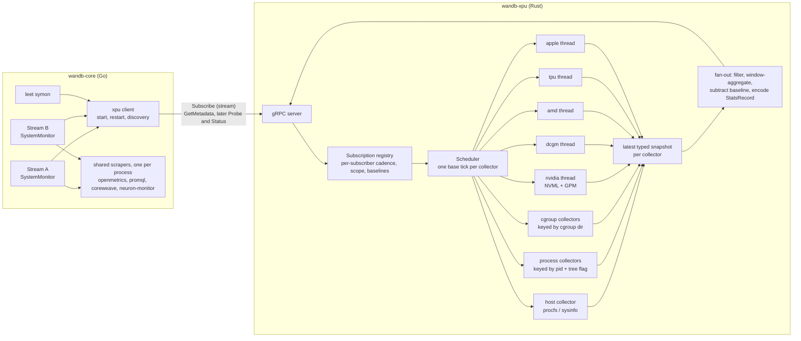

# wandb-xpu as the system telemetry service

Status: implemented through phase 4 on Linux and macOS; the remaining work is listed in section 9. Owner: SDK team. Scope: `core/internal/monitor`, `xpu`, `wandb/proto/wandb_system_monitor.proto`.

## Decisions in one screen

| Question | Decision |
| --- | --- |
| Move system monitoring from wandb-core to wandb-xpu? | The hardware and host collectors move: accelerators, CPU, memory, disk, network, cgroup, process metrics. The remote scrapers (OpenMetrics, DCGM exporter, CoreWeave metadata) and the `neuron-monitor` reader stay in Go, instantiated once per wandb-core instead of once per run. wandb-core also keeps what is not monitoring: settings-derived environment fields, the CoreWeave GraphQL gate, the per-run `_system_metrics` buffer, and label suffixing. |
| Keep the name `xpu`? | Yes. Keep the binary name `wandb-xpu`; redefine it as "system telemetry for any processing unit". Rename only the internal Rust trait (`GpuMonitor` to `Collector`). |
| Client model | Replace per-run polling (`GetStats`) with subscriptions. The service owns the sampling clock, samples each source once per tick, and fans out per subscriber. |
| Different sampling intervals per run | Allowed. The clock ticks at a base period derived from its subscribers; a subscriber is served by the first tick at least its interval after its previous sample. The service may sample more often than a run asked for and never delivers more often. |
| Topology | By default one service per wandb-core, as today. With `x_stats_shared_xpu`, one shared daemon per machine and user, discovered through a fixed socket; the client falls back to a private service when the shared one cannot be reached. The protocol is identical in both modes. |

## 1. Why the current model does not scale

### 1.1 What happened before phase 1

`SystemMonitor` (`core/internal/monitor/monitor.go`) runs one ticker per run stream. On every tick it calls `Sample()` on each `Resource` in a goroutine. The `XPU` resource sent a unary `GetStats(pid, gpu_device_ids)` to the sidecar with a fixed 15 s deadline. The sidecar (`xpu/src/main.rs`) answered by running every accelerator monitor synchronously: NVML over all devices, DCGM, ROCm SMI, libtpu, Apple IOReport. Host metrics (CPU, memory, disk, network, cgroup), Trainium, OpenMetrics, the Prometheus DCGM exporter and CoreWeave metadata are separate Go resources, each instantiated per run.

### 1.2 What happens with 100 runs

Two cases matter and they fail differently.

**100 runs in one wandb-core** (one Python process with many runs, or child processes sharing the service through `WANDB_SERVICE`). There is one sidecar, but:

- Every run issued its own `GetStats`. The sidecar recomputed the full NVML sweep for each call under one `tokio::sync::Mutex`, on a tokio worker thread, blocking it. Per call and per device it also listed compute and graphics processes and walked `/proc` for descendants of the run's pid. Work was 100× a single run and fully serialized, so per-call latency grew with N. When it passed the run's interval, the Go side's `TryLock` skipped samples and the 15 s deadline cancelled calls. Runs started silently losing samples.
- GPM metrics were wrong, not just late. `NvidiaGpu.gpm_samples` pairs "the previous poll" with "this poll" per device, independent of who polled. With N callers at 15 s, each run's `smActive` averaged a window of 15/N seconds (150 ms at N=100, at the 100 ms floor), and callers saw different values. The per-device `availability` flags are shared the same way.
- The Go resources multiply too: 100 `System` samplers reading the same procfs files, 100 scrapes of the same OpenMetrics endpoint per interval, 100 identical PromQL queries, and, on Trainium, 100 `neuron-monitor` subprocesses, because `NewTrainium` runs per monitor.

**100 wandb-core processes on one node** (a sweep agent, `torchrun`, one process per run). There are 100 sidecars: 100 NVML contexts, 100 DCGM clients each creating field groups and 5 s watches against one `nv-hostengine`, 100 libtpu loads, 100 `neuron-monitor` processes. Even a perfect per-core sidecar cannot fix this; only a service shared by the processes that share a mount and pid namespace can.

### 1.3 Smaller problems the redesign should also fix

- The sidecar's sampling had no clock of its own, so it could not average over the run's real interval or precompute anything.
- Blocking FFI in async tasks: NVML and ROCm SMI run inline on tokio workers. DCGM and Apple already use a dedicated OS thread; that is the right pattern.
- Error classification is string matching on messages (`ShouldCaptureSamplingError`).
- The per-process `cpu` metric uses gopsutil's `CPUPercent()`, which is the lifetime average since the process started, not utilization over the sampling interval. It lags for long runs.
- `gpu.process.N.*` mirrors device-wide values when the run's pid is present on the device; it is not the process's share.
- LEET's `symon` re-implements the sampling loop on top of `Resource` with its own sidecar at 2 s.

## 2. Goals and non-goals

Goals:

1. Cost independent of the number of runs: one sample per source per tick, no matter how many subscribers.
2. Correct window semantics for rate metrics regardless of how many subscribers there are or what intervals they use.
3. Key-for-key parity with today's metrics and run metadata, verified mechanically, with a short list of intentional changes.
4. One implementation of every hardware and host collector, in Rust, usable by wandb-core, LEET and other SDKs.
5. A protocol that works unchanged for a private sidecar and for a shared node daemon.

Non-goals for this design: changing metric names or the `StatsRecord` wire format, changing how stats reach the backend, or replacing the Python-side settings surface.

## 3. Architecture



### 3.1 Collectors and scopes

A collector is a unit with its own state, thread and tick. Each declares a scope key so that identical requests share one instance:

| Collector | Scope key | Sources |
| --- | --- | --- |
| host | none (one per service) | memory, swap, host CPU and per-core CPU, CPU temperature, load, uptime, disk usage for the union of requested paths, disk I/O per device, network per interface, TCP counters, PSI, top processes |
| process | (pid, track_tree) | CPU time, RSS, threads for the process or its tree |
| cgroup | cgroup directory of the pid | memory.current/max, cpu.max, cpu.stat, memory.events |
| self | none | wandb-core pids passed by subscribers, plus the service itself |
| nvidia | none | NVML, GPM; device union of all subscribers |
| dcgm | none | profiling fields through `nv-hostengine`, when a subscriber asks for it |
| amd, tpu, apple | none | as today |

Collectors run only while they have at least one subscriber. A notebook between cells costs nothing.

Hardware collectors each own one OS thread that holds the FFI handle and receives `Tick` and `Probe` commands over a channel, the pattern DCGM and Apple already use. Host and process collectors read procfs on a blocking thread. Nothing blocks a tokio worker, and a panic inside a sweep is caught by the sweep task and reported as an empty sample rather than ending the clock.

The remote scrapers and the `neuron-monitor` reader are not collectors of the service. They stay in Go because they gain nothing from Rust: the HTTP client, retry policy and LRU they use remain in wandb-core for other reasons, and moving them would add an HTTP/1.1 and TLS stack, a regex engine and a Prometheus text parser to the sidecar. What they need is to run once per wandb-core instead of once per run, which section 3.5 covers.

### 3.2 Scheduling: one clock per collector

Each collector has a base tick `T` computed from its subscribers' requested intervals `I_s`, quantized to 100 ms, and a hardware floor `F` (NVML and ROCm 100 ms, DCGM 1 s, TPU 1 s, host and process 100 ms):

```
g = gcd(I_1, ..., I_n)                 # on the 100 ms grid
T = max(F, g)         if g >= min(I_s) / 4
T = max(F, min(I_s))  otherwise
```

Sweeps sit on a grid spaced `T` apart, scheduled from the previous grid sweep's scheduled time, not from when it finished, so a slow sweep does not stretch the period. A subscriber is served by the first grid sweep at least `I_s` after the sweep that last served it; an interval that is not a multiple of `T` lands on the next multiple above. Examples: {15} gives 15 s. {15, 2} gives 1 s. {15, 10} gives 5 s. {15, 7} gives 7 s and the 15 s subscriber is served every 21 s. {0.1, 15} gives 0.1 s.

A new or resumed subscriber gets one immediate sample, as `wake()` did: joining schedules an extra sweep, never within one second of the previous sweep, so a burst of runs starting together costs a few sweeps rather than one per run. The extra sweep serves only the subscribers waiting for their first sample and does not move the grid. When the subscriber set changes, `T` is recomputed and the next grid sweep is `T` after the previous one on the new tick, or now if that is already past.

Phase 1 ships one clock for the whole service, because every collector it has (NVML, DCGM, ROCm, TPU, Apple) serves every subscriber. Per-collector clocks arrive with the collectors that have per-subscriber scopes. Later refinements, not needed for correctness: re-issuing DCGM's watch frequency to match `T`, and marking a collector degraded when it exceeds a per-tick deadline instead of letting a slow sweep delay the tick. The client no longer has a per-sample timeout.

### 3.3 Fan-out semantics by metric kind

Collectors emit typed values; the kind decides what a subscriber receives on its due tick:

| Kind | Examples | Delivered value |
| --- | --- | --- |
| gauge | `gpu.0.temp`, `memory_percent`, `proc.memory.rssMB` | last tick's value (today's semantics) |
| window average | GPM and DCGM profiling metrics, PCIe throughput, process `cpu`, `proc.cpu.throttledPercent` | mean over the sweeps since this subscriber's previous delivery, each sweep weighted by the time since the sweep before it |
| cumulative since subscription | `network.sent`, `network.recv`, `network.tcpRetransmits`, `disk.<dev>.in/out`, `proc.memory.oomKills` | raw monotonic counter minus this subscriber's baseline, captured on its first tick |
| static | `_gpu.N.name`, `_cuda_version` | never in stats; used by `Probe` |

Baselines belong to the subscriber, not to the stream: they are kept under the client-chosen `subscriber_id` across stream closes, so a notebook run that pauses between cells and a client that reconnects to a restarted daemon keep counting from where they started. The service drops a subscriber's baselines ten minutes after its last stream closed.

Per-subscriber filters apply here too: `gpu_device_ids` drops other devices' keys and disk paths select usage keys and the devices behind them. This is the only place run-specific logic lives, and it is a subtraction and a filter per subscriber per tick.

Because rates are averaged over the subscriber's own window, the GPM bug in 1.2 disappears: at 1 s ticks a 15 s subscriber gets the time-weighted mean of fifteen 1 s averages, which is the 15 s average.

### 3.4 Protocol

Phase 1 replaces `GetStats` in `wandb/proto/wandb_system_monitor.proto` with a server-streaming subscription and keeps `GetMetadata` and `TearDown`:

```proto
service SystemMonitorService {
  // Streams system metrics sampled at the subscriber's interval until the
  // client cancels the stream.
  rpc Subscribe(SubscribeRequest) returns (stream SubscribeResponse);
  rpc GetMetadata(GetMetadataRequest) returns (GetMetadataResponse);
  rpc TearDown(TearDownRequest) returns (TearDownResponse);
}

message SubscribeRequest {
  double interval_seconds = 1;
  int32 pid = 2;
  repeated int32 gpu_device_ids = 3;
}

message SubscribeResponse {
  Record record = 1;  // the same StatsRecord core forwards today
}
```

The stream's lifetime is the subscription's lifetime: cancelling it unsubscribes, which also covers client crashes. Pausing a run closes its stream and resuming opens a new one, which delivers the immediate first sample, so there is no separate pause RPC. Metadata is static for the life of the service, so `GetMetadata` computes it once and serves the cached record afterwards; a hundred runs starting together no longer cost a hundred sweeps.

Later phases grow the request as collectors move over. Fields are only added, so the phase 1 numbers stay. The target shape:

```proto
service SystemMonitorService {
  rpc Subscribe(SubscribeRequest) returns (stream SubscribeEvent);
  // Run metadata (EnvironmentRecord) for a scope; replaces GetMetadata.
  rpc Probe(ProbeRequest) returns (ProbeResponse);
  // Collector states, subscribers, tick durations, dropped events.
  rpc Status(StatusRequest) returns (StatusResponse);
  rpc TearDown(TearDownRequest) returns (TearDownResponse);
}

message SubscribeRequest {
  double interval_seconds = 1;
  int32 pid = 2;
  repeated int32 gpu_device_ids = 3;
  // Identifies the subscriber across streams, e.g. the run's stream id.
  // Cumulative metrics keep their baseline when a stream with the same id
  // reopens after a pause or a reconnect.
  string subscriber_id = 4;
  bool track_process_tree = 5;
  // Allowlisted environment of the run's process (SLURM_*, LOCAL_RANK).
  // Passed explicitly so that a shared daemon does not depend on its own env.
  map<string, string> env = 6;
  // Pids whose usage is reported as wandb.cpu / wandb.memory.rssMB.
  repeated int32 wandb_pids = 7;
  repeated string disk_paths = 8;
  bool disable_cgroup = 9;
  // Collectors that are off unless a subscriber asks, so that a shared
  // daemon does not depend on the flags it was started with.
  bool enable_dcgm_profiling = 10;
}

message SubscribeEvent {
  oneof event {
    Subscribed subscribed = 1;       // effective_interval_seconds
    StatsRecord stats = 2;           // unchanged wire type, forwarded as is by core
    CollectorStatus status = 3;      // collector, state, structured error code, message
  }
}
```

Each subscriber has a bounded outbound queue; when the client falls behind, the newest record is dropped rather than blocking the sweep.

### 3.5 wandb-core after the move

`core/internal/monitor` shrinks to:

- `client.go`: locate or start the service, connect, restart the sidecar with backoff when it exits or fails to start, and resubscribe. In the shared-daemon phase the same path reconnects and re-elects.
- `monitor.go`: build `SubscribeRequest` from settings, forward `StatsRecord`s into the stream, append the `/l:<label>` suffix, feed the `x_stats_buffer_size` buffer, close the stream on `Pause` and reopen it on `Resume`, call `Probe` and merge the result with `probeExecutionContext()` and the user overrides.
- `cwgate.go`: the `OrganizationCoreWeaveOrganizationID` GraphQL check that decides whether CoreWeave metadata is fetched.
- `openmetrics.go`, `dcgm_exporter.go`, the HTTP half of `cwmetadata.go`, and `trainium.go`, unchanged in what they read. `ScraperRegistry`, injected like `XPUResourceManager` (`core/internal/stream/streaminject.go`), hands every `SystemMonitor` with the same (url, headers, filters) the same OpenMetrics or DCGM exporter scraper. The scraper runs at the smallest of its subscribers' intervals and once more when a subscriber joins; each subscriber's next sample is the latest scrape it has not seen, or that scrape's error, which it triages as its own. It keeps running while its runs are paused and stops when the last one finishes. Trainium and CoreWeave metadata stay per run.

Deleted: `system.go`, `cgroup.go`, `querymap.go`, and the symon-only host resources (`cpu.go`, `host.go`, `processes.go`) once the host collector carries their keys. `buffer.go` stays. gopsutil and procfs leave wandb-core's dependency graph, which continues the binary-size work. LEET's `symon` becomes a 2 s subscriber of the same client.

### 3.6 Lifecycle

Private sidecar mode: lazily started by the first subscriber in a wandb-core, portfile handshake, `TearDown` when the last subscriber leaves, exits when the parent dies. Since the host collectors live in the sidecar on Linux, a sidecar that is missing or dies takes every system metric with it, so the client treats the sidecar as restartable: a failed start or an ended stream is captured once, then retried with backoff from 1 s to 1 min, and each run resubscribes under its `subscriber_id` when the service is back. A wheel built with `WANDB_BUILD_SKIP_WANDB_XPU` collects no system metrics on Linux; `xpu/hatch.py` says so, and the Go collectors remain for a platform until its Rust port passes the fixtures in section 6.

Node-shared mode (`x_stats_shared_xpu`, Linux and macOS; the setting is ignored on Windows):

- The shared scope is the processes that share a mount and pid namespace: the daemon reads procfs and cgroup files through the subscriber's pid, so runs in different network or cgroup scopes inside that namespace are served correctly, and a container gets its own daemon.
- Socket at `${XDG_RUNTIME_DIR:-/tmp}/wandb-xpu-<uid>/<id>.sock`, directory mode 0700 and owned by the user, socket mode 0600, where the id is the first 16 hex digits of the SHA-256 of the `wandb-xpu` binary. Different wandb versions on one machine get different sockets and never talk to the wrong binary. A path longer than the socket address limit falls back to the private sidecar.
- A client connects; on failure it takes an exclusive `flock` on `<socket>.lock` (bounded by 10 s), probes again, unlinks a stale socket, spawns `wandb-xpu --listen <socket> --idle-timeout 600` in its own session with detached stdio, waits until it can connect, and releases the lock. The lock file is never removed. A daemon that finds the socket already served exits with status 1. Any failure falls back to private-sidecar mode with one debug line.
- The daemon exits after ten minutes with no subscribers, which outlives the baselines it retains for a paused run: it takes the lock, checks again that it has no subscribers, unlinks its socket, releases the lock and exits, so a client that connected in between is never left talking to a process that is going away. A client whose stream ends re-runs the election through the restart path above. The daemon is not tied to a parent pid and exits on SIGTERM and SIGINT, unlinking its socket.
- Collectors that are off by default (DCGM profiling) should be enabled per subscriber through the request rather than the daemon's command line, so that the first client's flags do not decide what later clients get. Today the socket name carries the flag, so processes with and without DCGM profiling share two daemons instead of one; the request field is open work.
- On a daemon crash every client reconnects, re-elects, and resubscribes under its `subscriber_id`; cumulative metrics stay continuous because their raw counters are host-monotonic and the baseline lives with the subscriber id. The new daemon has no baselines, so the first sample after a crash restarts the counters; that is the one case where they reset.

### 3.7 Observability

`CollectorStatus` carries a structured state and error code, so core logs at the right level without string matching. `Status` exposes per-collector p50 and p99 tick durations, subscriber counts, dropped events and caught panics, which `wandb leet` can show and load tests can assert on. `wandb.cpu` and `wandb.memory.rssMB` continue to cover core plus the service.

## 4. Sampling intervals: allow them, own the clock

Options considered:

1. One global interval per service, first subscriber wins. Rejected: it silently overrides a public per-run setting, differs by start order, and still needs per-subscriber due times for late joiners and pause/resume.
2. Fixed high-rate sampling with downsampling. Rejected as the default: it burns CPU when nobody needs sub-15 s data and samples while idle.
3. Subscriber-driven base tick with per-subscriber due times (section 3.2). Chosen.

Consequences to document for users: `x_stats_sampling_interval` stays per run and keeps its 0.1 s minimum. The service may sample more often than a run asked for and never delivers more often than asked. An interval that is not a multiple of the base tick is served on the next multiple above it, with the bound in 3.2 keeping oversampling under 4×; the effective interval is reported back once the `Subscribed` event exists.

## 5. Parity inventory

| Today | Owner today | New owner | Notes |
| --- | --- | --- | --- |
| `cpu`, `proc.memory.rssMB`, `proc.memory.percent`, `proc.cpu.threads`, process tree | Go, gopsutil | process collector | `cpu` becomes interval-average. Intentional change, see section 7. |
| `memory_percent`, `proc.memory.availableMB` | Go, gopsutil and cgroup v2 | host + cgroup collectors | Replicate gopsutil's Linux formulas from procfs; pin them in tests. macOS and Windows through `sysinfo`. |
| `disk.<path>.usagePercent/usageGB`, `disk.<dev>.in/out` and device resolution (overlay root fallback, pseudo-device filter) | Go | host collector | Port the heuristics as they are, including the "root missing" case. |
| `network.sent/recv` (skip loopback and enslaved), `network.tcpRetransmits` | Go | host collector | `/proc/<pid>/net/dev`, `/proc/<pid>/net/snmp`; `/sys/class/net/*/master`. |
| `proc.cpu.throttledPercent`, `proc.memory.oomKills`, cgroup denominators | Go | cgroup collector | Port `cgroup_test.go` fixtures to Rust. |
| `wandb.cpu`, `wandb.memory.rssMB` | Go | self collector | Includes the service in node mode; document. |
| `cpu.N.cpu_percent`, `cpu.avg_temp`, load, uptime, swap, top processes (symon only) | Go, gopsutil cpu, sensors, host, load, process | host collector | Key names unchanged. Runs do not log these; symon does. |
| `gpu.N.*`, `gpu.process.N.*`, GPM | Rust | nvidia collector | Move to a dedicated thread; window-average GPM; union device set. |
| DCGM profiling | Rust | dcgm collector | Watch frequency follows the base tick. |
| AMD, TPU, Apple | Rust | unchanged collectors | Apple keeps its `cpu.*` and `memory.*` keys alongside host keys, as today. |
| `trn.*` | Go, `neuron-monitor` child | Go, one child per process | Shared through the registry; `LOCAL_RANK` filtering per run as today. |
| `openmetrics.<name>.<metric>.<idx>` | Go | Go, one scrape per endpoint per process | Label index map per (endpoint, filters), shared by the runs of a process. |
| DCGM exporter PromQL | Go | Go, one PromQL round per process | Same parsing of `gpu`/`device` labels. |
| Metadata: cpu counts, memory total, disk info | Go | `GetMetadata` on Linux, Go elsewhere | SLURM vars stay in Go (`probeExecutionContext`), with the other settings-derived environment. |
| Metadata: GPU inventory, CUDA version, Apple, TPU | Rust and Go | `Probe` | Unchanged content. |
| CoreWeave metadata | Go, GraphQL + HTTP | Go | Unchanged. |
| `_system_metrics` buffer, `/l:<label>`, setting overrides, `probeExecutionContext` | Go | Go | Not monitoring; unchanged. |
| Pause/resume, wake on start | Go loop | stream close and reopen | Immediate sample on resume preserved; cumulative baselines survive through `subscriber_id`. |
| Error triage (`ShouldCaptureSamplingError`) | Go, message matching | structured `CollectorStatus` | Same outcomes, explicit codes. |

Rust dependencies to add: `procfs` (Linux) and `sysinfo` (macOS, Windows). Windows keeps TCP and the portfile.

## 6. Verification

- Fixture tests: Rust unit tests over `/proc` and cgroup trees ported from `cgroup_test.go` and `system_test.go`, pinning gopsutil's formulas (memory percent, disk device resolution, enslaved interfaces) value for value.
- Per-platform cut-over: `initializeResources` picks the Rust host collector or the Go `System` by `runtime.GOOS`. Linux switches first; macOS and Windows switch when their ports pass the same fixtures and a one-off key and value comparison against the Go resource on that platform, run by the author and attached to the PR. No setting toggles the backend.
- Load test: 200 subscribers on one service at mixed intervals; assert exactly one NVML sweep per base tick from `Status`, no dropped events, p99 fan-out under 5 ms.
- Existing `tests/system_tests/test_system_metrics` keep passing unchanged; the Linux job asserts the host key set once the Rust collector serves it.

## 7. Intentional differences from today

- Process `cpu` is utilization over the sampling window instead of the lifetime average. Announce it in the changelog; it fixes a long-standing lag.
- Samples of runs with equal intervals share timestamps.
- OpenMetrics label indexes are consistent across the runs of one process that scrape the same endpoint with the same filters.
- A run's first sample after start or resume is immediate, as before, but later ones sit on the shared grid rather than the run's own phase. An interval that is not a multiple of the base tick is served less often, never more often, than asked.

## 8. Beyond parity

The shared clock and typed snapshots make these cheap; none is required for the migration:

- Window statistics per subscriber (`mean`, `max`, `p95`) at 1 s ticks while logging at 15 s.
- True per-process GPU share from NVML process utilization and per-process memory, replacing the device-wide mirror in `gpu.process.N.*`.
- Host-wide CPU utilization, load average and PSI for runs, which today only symon collects.
- Events instead of counters: NVML Xid and thermal throttle reasons, ECC page retirement, cgroup OOM events with timestamps.
- Fabric counters: InfiniBand and RoCE port counters from sysfs, NVLink per link.
- The same service for the experimental Rust and Go SDKs and for `wandb leet symon` on a machine with no run.

## 9. Migration plan

1. **Protocol and scheduler.** Done: the collectors sample every device once per sweep and the per-request parts (device filter, `gpu.process.N.*` mirror) move into the response; `Subscribe`, the registry, the clock and the fan-out replace `GetStats` in `xpu`; the Go `XPU` resource and LEET subscribe; `GetMetadata` is cached; the client restarts the service and resubscribes. Core and the service always ship in one wheel, so no cross-version compatibility is needed.
2. **Host collectors in Rust.** Done on Linux: `xpu/src/host.rs` reads procfs and sysfs with fixture tests, wandb-core and `symon` skip the Go `System` resource by `runtime.GOOS`. Open: macOS and Windows through `sysinfo`, then deleting `system.go`, `cgroup.go` and the symon host resources (`cpu.go`, `host.go`, `processes.go`); per-collector clocks; the `Subscribed` and `CollectorStatus` events.
3. **Shared Go collectors.** Done for OpenMetrics and the DCGM exporter through `ScraperRegistry`. Trainium stays per run (its `neuron-monitor` output is filtered per pid) and CoreWeave metadata is probe-only.
4. **Node-shared daemon.** Done behind `x_stats_shared_xpu`: discovery, election, idle exit, reconnect through the restart path. Open: the per-subscriber DCGM profiling flag, then default on Linux and macOS after a release of telemetry.

## 10. Risks

- Platform parity on macOS and Windows for disk I/O counters and per-process CPU is the least certain part of the port. The fixtures and the per-platform cut-over keep the Go path on a platform until its port passes.
- From phase 2 on, the sidecar is the only source of system metrics. The restart path in 3.6 is the mitigation; a build without wandb-xpu has none and says so in its documentation.
- The name `xpu` still reads as "accelerators only" to newcomers. Fix in docs and the binary's `--help` text; a rename would touch `hatch_build.py`, `getXPUCmdPath`, the `WANDB_BUILD_SKIP_WANDB_XPU` variable, log file names and docs, about one PR, if it is ever wanted.
- A shared daemon is a new failure domain. It is why phase 4 is opt-in first, why fallback to a private sidecar is automatic, and why the socket path carries the build id.
- libtpu and DCGM behave badly with many clients; the shared daemon is the fix, and until then the per-core service is no worse than today.
