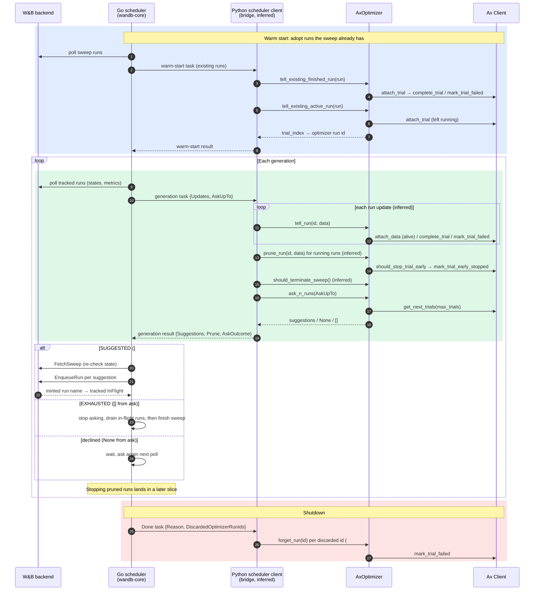
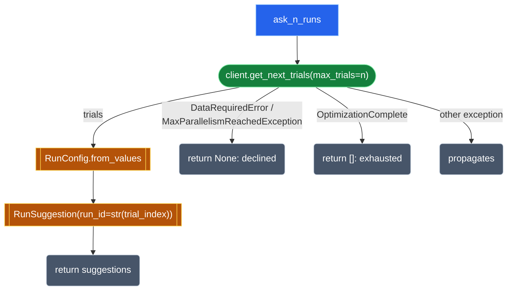
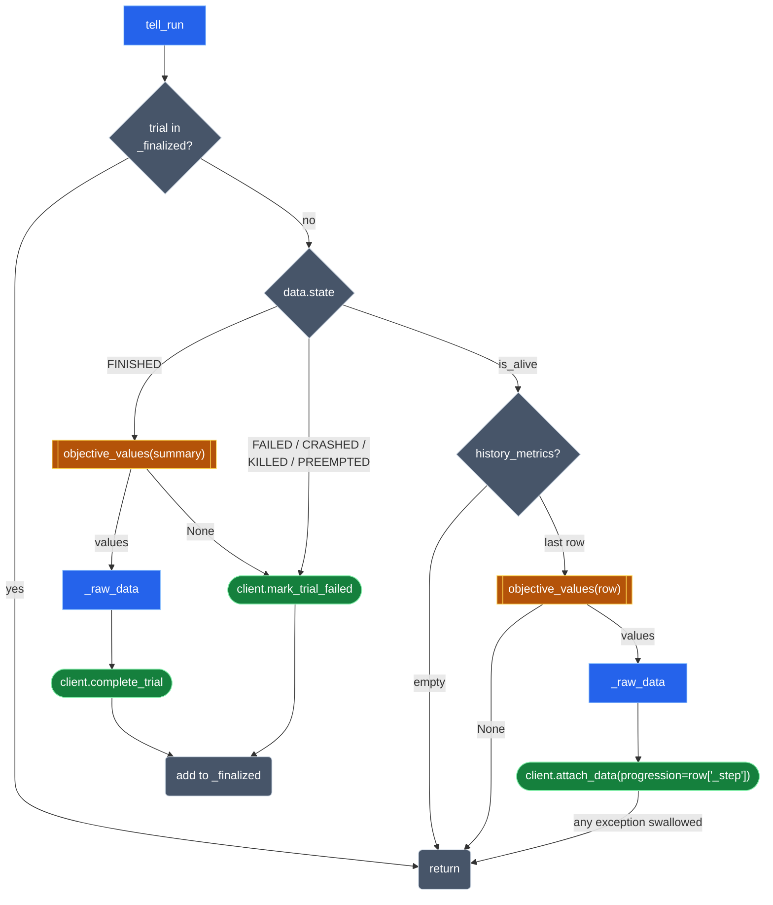
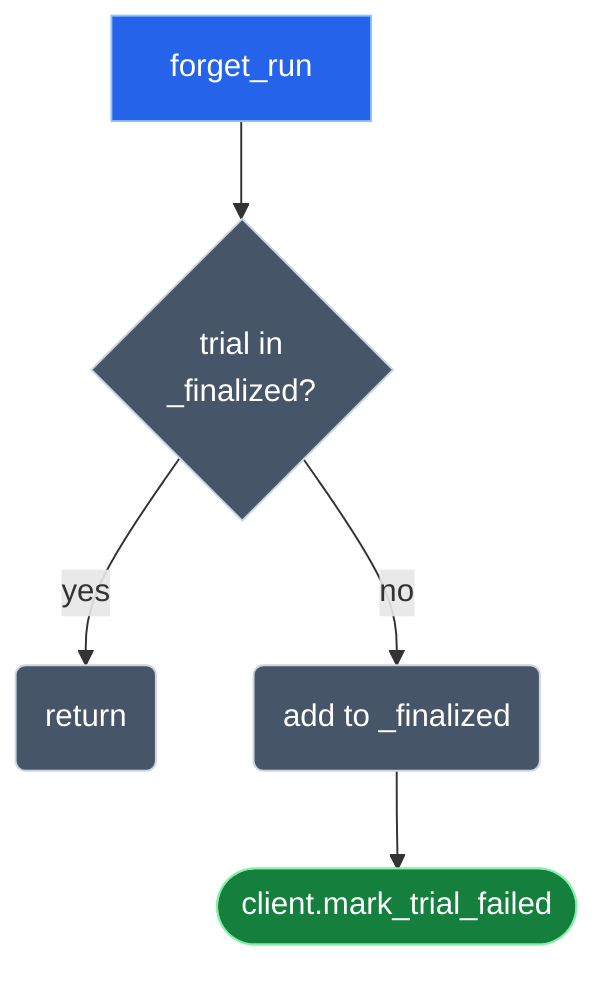
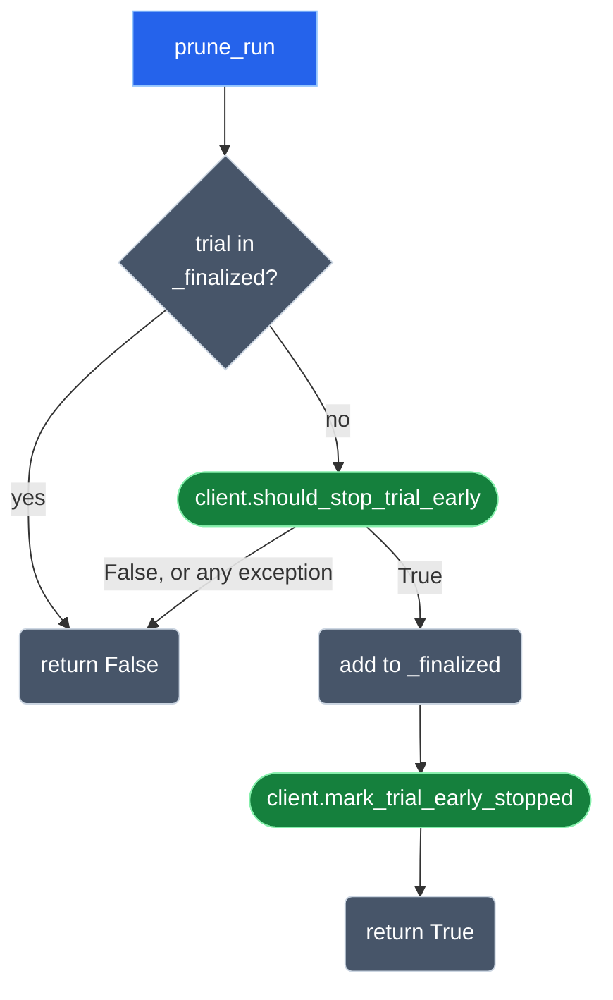
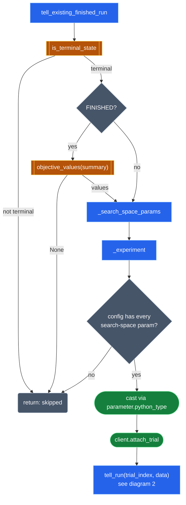
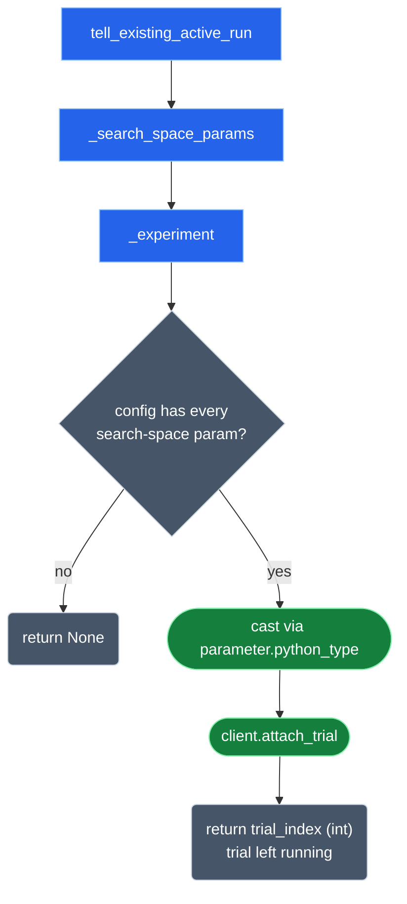
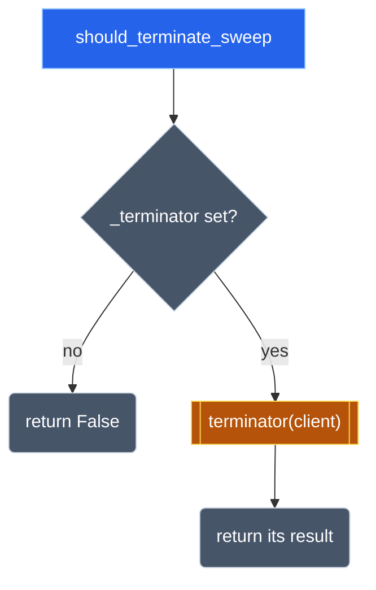

# Ax Scheduler

## Ax Scheduler Sequence Diagram

## `ask_n_runs(n)`

## `tell_run(run_id, data)`

The alive branch is _attach_latest_progression, inlined. _raw_data zips the base class's metric_names() with the objective values.

## `forget_run(run_id)`

## `prune_run(run_id, data)`

## `tell_existing_finished_run(data)` (warm start)

## `tell_existing_active_run(data)` (adopt an in-flight run)

## `should_terminate_sweep()`

